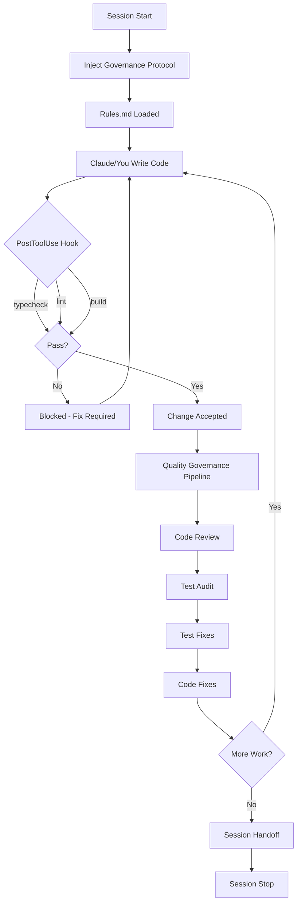
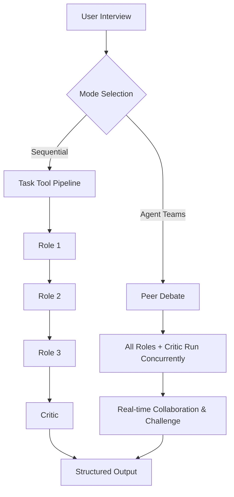

<p align="center">
  
</p>

<h1 align="center">The Bulwark</h1>

<p align="center">
  SDLC governance & enforcement for Claude Code.
  <br />
  Turn stochastic AI output into engineering-grade artifacts.
</p>

<p align="center">
  <a href="#quick-install">Install</a> &middot;
  <a href="#how-it-works">How it works</a> &middot;
  <a href="#hooks">Hooks</a> &middot;
  <a href="#skill-registry">Skills</a> &middot;
  <a href="#agent-registry">Agents</a> &middot;
  <a href="#planned-enhancements">Roadmap</a>
</p>

<p align="center">
  <a href="https://www.npmjs.com/package/@qball-inc/the-bulwark"></a>
  <a href="LICENSE"></a>
</p>

---

### If you find this useful, please give it a star. It helps others discover the project.

[](https://github.com/QBall-Inc/the-bulwark)

## What is The Bulwark?

The Bulwark is a [Claude Code plugin](https://docs.anthropic.com/en/docs/claude-code/plugins) that adds automated quality enforcement to your development workflow. It ships 28 skills, 15 custom agents, and a set of hooks that run programmatic checks on every code change you make.

The Bulwark is the culmination of close to 6 weeks and 100 sessions of intense planning & research, co-partnered by Claude and myself. The goal was straightforward: take everything I'd learned running Claude Code over 8 months and package it into a governance layer that actually enforces standards instead of suggesting them.

## Who is it for?

- Builders who want to stay in the driver's seat while giving Claude semi-autonomy over structured workflows
- Teams that need repeatable, auditable AI-assisted development
- Users on Claude Max & Enterprise plans (the multi-agent pipelines are token-intensive)

## Who is it not for?

- While it can be used by those who prefer to run `--dangerously-skip-permissions` on Claude Code, this plugin may work with slight modifications, I do not recommend it
- Users on Claude Free, Pro, or Pro Plus plans. The multi-agent orchestration burns through tokens fast, and rate limits on lower tiers will interrupt pipelines mid-execution.

## Why?

Claude Code is remarkably capable on its own. But capability without consistency is a problem.

Without guardrails, you get:
- Code that compiles but skips type checks, lint, or tests
- Reviews that miss security issues because a single pass can't cover everything
- Test suites full of mocks that verify function calls instead of real behavior
- Plans and estimates that vary wildly between sessions

The Bulwark fixes this by making enforcement automatic. Hooks run quality checks after every write. Skills orchestrate multi-agent pipelines where each agent has a single focus. Rules are injected at session start and enforced throughout. You don't have to remember to ask Claude to run tests or check types. It just happens.

## Quick install

Two ways to install. Pick whichever works for you.

### Option A: npm

```bash
claude /plugin install npm:@qball-inc/the-bulwark
```

### Option B: Marketplace

First, add the QBall-Inc marketplace (one-time setup):

```bash
claude /plugin marketplace add QBall-Inc/plugins-market
```

Then install:

```bash
claude /plugin install the-bulwark@qball-inc
```

### Post-install

After installing, restart your Claude Code session and run the init skill:

```
/the-bulwark:init
```

This walks you through a guided setup: Rules.md injection, CLAUDE.md configuration, and optional tooling (LSP, Justfile scaffolding, statusline). It auto-detects brownfield projects and adjusts accordingly.

> Having trouble installing? See [FAQ and troubleshooting](#faq-and-troubleshooting). If your issue isn't covered, please [open an issue](https://github.com/QBall-Inc/the-bulwark/issues).

## Prerequisites

| Requirement | Details |
|-------------|---------|
| Claude Code | Latest version recommended. Plugin support required. |
| Node.js | v18+ (for TypeScript tooling and `just` recipes) |
| [just](https://github.com/casey/just) | Command runner used for build/typecheck/lint recipes. `/the-bulwark:init` offers to install it for you. |
| Language Servers | TypeScript (`typescript-language-server`), Python (`pyright`), etc. The LSP setup within `/the-bulwark:init` will offer to install language servers for your project's languages. |
| Platform | Linux, macOS, WSL2. Native Windows is not tested. |
| Claude Plan | Max or Enterprise recommended. Pro Plus works for single-agent skills but will hit rate limits on multi-agent pipelines. |

## How it works

The Bulwark has different orchestration models for coding and non-coding workflows.

### Coding workflows

The coding side operates as a defense-in-depth system with three layers:



**Layer 1: Rules.** Injected into Claude's context at session start via the `SessionStart` hook. They define coding standards, testing requirements, and verification rules. Claude follows them because they're part of its active instructions, not because you asked nicely.

**Layer 2: Hooks.** Run after every `Write` or `Edit` operation. The `enforce-quality.sh` hook fires `typecheck`, `lint`, and `build` checks. If any fail, the change is flagged and Claude sees the errors. No silent failures.

**Layer 3: Pipelines.** Multi-agent workflows orchestrated by skills. A code review spawns 3-4 specialized agents (security, type safety, standards, synthesis). A test audit classifies every test file and checks for mock abuse. Each agent writes structured output to `logs/`, and only a summary returns to the main context.

### Non-coding workflows

The Bulwark also orchestrates research, brainstorming, and planning workflows that don't involve writing code. These run entirely through multi-agent pipelines.

**Research.** The `/the-bulwark:bulwark-research` skill spawns 5 parallel sub-agents, each researching a different viewpoint on your topic. After a short user interview, agents run concurrently and their findings merge into a single synthesis document. Useful for market research, competitor analysis, or deep dives on technical topics before you commit to a direction.

**Product Ideation.** The `/the-bulwark:product-ideation` skill spawns a full ideation team (6 agents) after a short user interview: market researcher, idea validator, competitive analyzer, segment analyzer, pattern documenter, and strategist. The pipeline produces a structured BUY/HOLD/SELL recommendation backed by evidence from each stage.

**Brainstorm & Plan Creation.** These two skills share a dual-mode orchestration pattern. You choose the mode based on how contested the topic is:



**Sequential mode.** Each role writes its output, then the next role reads it and builds on it. Structured, predictable, lower token cost. Best for well-understood topics where roles won't disagree much.

**Agent Teams mode.** All roles run concurrently and debate in real-time. The Critic challenges assumptions as they form, not after they've hardened. Better convergence on contested topics, more token-intensive. Best for novel problems where you want genuine adversarial pressure on every claim.

## Conventions

The Bulwark enforces a specific set of conventions through `Rules.md`. When you run `/the-bulwark:init`, it installs these rules into your project at `.claude/rules/rules.md` where Claude Code automatically loads them every session. It also creates a `CLAUDE.md` with project-specific instructions (backing up any existing one first), and lets you choose scope — project-level (checked into the repo, shared with your team) or user-level (local to your machine, not committed).

The rules cover four areas:

**Coding Standards (CS1-CS4).** Single responsibility, no magic, fail fast, clean code. Every function does one thing. No hidden dependencies. Validate inputs at boundaries. Delete dead code instead of commenting it out.

**Testing Rules (T1-T4).** Never mock the system under test. Verify observable output, not function calls. Integration tests use real systems. Write tests with implementation, not after. These four rules alone eliminate the most common failure modes in AI-generated test suites.

**Verification Rules (V1-V4).** Never declare a fix complete without running it. Use `just` for all execution. Check logs for full output before attempting fixes. Verify compilation after every change.

**Issue Debugging (ID1-ID3).** Understand the root cause before fixing. Rank complexity. Run the right level of tests. Document the debugging journey.

Rules are not advisory. They're injected as binding instructions. Claude treats them as contract obligations, not suggestions.

## Hooks

The Bulwark installs four hooks that run automatically. No manual invocation needed.

| Hook | Event | Trigger | Timeout | What It Does |
|------|-------|---------|---------|--------------|
| `enforce-quality.sh` | PostToolUse | Every `Write` or `Edit` on code files | 60s | Runs `just typecheck`, `just lint`, `just build`. Flags failures to Claude with full error output. Skips non-code files (`tmp/`, `logs/`, `.claude/`, `docs/`). |
| `inject-protocol.sh` | SessionStart | Every new session | 5s | Injects the governance protocol into Claude's context. Loads Rules.md, activates quality enforcement, displays the activation banner. |
| `cleanup-stale.sh` | SessionStart | Every new session | 30s | Deletes files older than 10 days from `logs/` and `tmp/`. Preserves `.gitkeep` files. Keeps your repo from accumulating stale pipeline output. |
| `track-pipeline-start.sh` | SubagentStart | Any sub-agent spawned | 30s | Logs pipeline invocation metadata (agent name, timestamp, parent context) for observability. |
| `track-pipeline-stop.sh` | SubagentStop | Any sub-agent exits | 30s | Logs pipeline completion metadata (agent name, duration, exit status) for observability. |

All hooks use `${CLAUDE_PLUGIN_ROOT}` for path resolution, so they work regardless of where the plugin is installed.

## Skill registry

The Bulwark ships 28 skills. Each one is invoked with `/the-bulwark:{skill-name}` or triggered automatically by hooks and pipelines. Skills are grouped by what they do.

### Product & strategy

Skills for ideation, research, and planning. These don't write code. They run multi-agent pipelines that produce structured documents.

| Skill | What it does | Sub-agents |
|-------|-------------|------------|
| [product-ideation](docs/skills/product-ideation.md) | Evaluates product ideas through a 6-agent pipeline. Produces a BUY/HOLD/SELL recommendation with market analysis, competitive intelligence, and segment targeting. | [market-researcher](docs/agents/product-ideation-market-researcher.md), [idea-validator](docs/agents/product-ideation-idea-validator.md), [competitive-analyzer](docs/agents/product-ideation-competitive-analyzer.md), [segment-analyzer](docs/agents/product-ideation-segment-analyzer.md), [pattern-documenter](docs/agents/product-ideation-pattern-documenter.md), [strategist](docs/agents/product-ideation-strategist.md) |
| [bulwark-research](docs/skills/bulwark-research.md) | Spawns 5 parallel sub-agents to research different viewpoints on a topic. Merges findings into a synthesis document. | 5 parallel Sonnet agents (dynamically created) |
| [bulwark-brainstorm](docs/skills/bulwark-brainstorm.md) | Dual-mode brainstorming. `--scoped` runs 5 roles sequentially via Task tool. `--exploratory` runs 4 roles concurrently via Agent Teams with real-time peer debate. | Sequential: 5 role agents. Agent Teams: 4 concurrent agents + Critic. |
| [plan-creation](docs/skills/plan-creation.md) | Creates implementation plans with a 4-role scrum team. Produces phases, workpackages, tasks, and delivery schedules. Dual-mode (Task tool or Agent Teams). | [PO](docs/agents/plan-creation-po.md), [Architect](docs/agents/plan-creation-architect.md), [Eng Lead](docs/agents/plan-creation-eng-lead.md), [QA/Critic](docs/agents/plan-creation-qa-critic.md) |

### Code quality

Skills that review, test, and fix code. These are the enforcement layer that runs after you write code.

| Skill | What it does | Sub-agents |
|-------|-------------|------------|
| [code-review](docs/skills/code-review.md) | Three-phase code review: static tools, LLM judgment across 3-4 aspects (security, type safety, standards), and diagnostic log. | 3-4 Sonnet agents (aspect-specific) |
| [test-audit](docs/skills/test-audit.md) | Audits test suites for T1-T4 violations using AST analysis, mock detection, and multi-stage synthesis. Triggers automatic rewrites when quality gates fail. | Haiku (classification), Sonnet (mock detection, synthesis) |
| [fix-bug](docs/skills/fix-bug.md) | 5-stage fix validation pipeline: analyze, implement, write tests, audit tests, validate fix. | [issue-analyzer](docs/agents/bulwark-issue-analyzer.md), [implementer](docs/agents/bulwark-implementer.md), [fix-validator](docs/agents/bulwark-fix-validator.md) |
| [issue-debugging](docs/skills/issue-debugging.md) | Systematic debugging methodology with root cause analysis, impact mapping, tiered validation plans, and confidence assessment. | [issue-analyzer](docs/agents/bulwark-issue-analyzer.md), [fix-validator](docs/agents/bulwark-fix-validator.md) |
| [mock-detection](docs/skills/mock-detection.md) | Deep mock appropriateness analysis. Determines whether mocks in a test file are legitimate or T1-T4 violations. | Sonnet agent (analysis) |
| [test-classification](docs/skills/test-classification.md) | Classifies test files by type (unit, integration, E2E) and identifies which files need deeper mock analysis. | Haiku agents (batch classification) |
| [test-fixture-creation](docs/skills/test-fixture-creation.md) | Creates unbiased test fixtures using a Sonnet agent that can't read the implementation. Fixtures integrate with project infrastructure and hook automation. | Sonnet agent (fixture generation) |
| [bulwark-verify](docs/skills/bulwark-verify.md) | Generates runnable verification scripts for components by orchestrating assertion-patterns and component-patterns. | Sonnet agent (script generation) |
| [assertion-patterns](docs/skills/assertion-patterns.md) | Reference for transforming T1-T4 violating tests into real output verification. Loaded by other skills as context. | None (reference skill) |
| [component-patterns](docs/skills/component-patterns.md) | Per-component-type verification approaches. Loaded by bulwark-verify as context for generating verification scripts. | None (reference skill) |
| [bug-magnet-data](docs/skills/bug-magnet-data.md) | Curated edge case test data for boundary testing. Provides pre-organized data by type (dates, strings, numbers, Unicode, etc.) for test generation. | None (reference skill) |

### Project setup & tooling

Skills for initializing projects, configuring tooling, and managing sessions.

| Skill | What it does | Sub-agents |
|-------|-------------|------------|
| [init](docs/skills/init.md) | Guided project initialization. Installs Rules.md, creates CLAUDE.md, offers LSP setup, Justfile scaffolding, and statusline configuration. Auto-detects brownfield projects. | None (orchestrates other skills) |
| [bulwark-scaffold](docs/skills/bulwark-scaffold.md) | Generates Justfile with build/typecheck/lint recipes, creates logs directory, and optionally configures hooks. | None |
| [setup-lsp](docs/skills/setup-lsp.md) | Configures Language Server Protocol integration. Detects project languages, offers to install language servers, verifies post-restart initialization. | None |
| [bulwark-statusline](docs/skills/bulwark-statusline.md) | Configures the Claude Code status line to show token usage and cost in real-time. Supports preset switching and customization. | [statusline-setup](docs/agents/statusline-setup.md) |
| [session-handoff](docs/skills/session-handoff.md) | Creates session handoff documents for context transfer between sessions. Ensures proper YAML headers, LF line endings, and complete documentation of progress and decisions. | None |
| [governance-protocol](docs/skills/governance-protocol.md) | The governance protocol injected at session start via the SessionStart hook. Not invoked directly. | None |

### Meta skills

Skills for building more skills, orchestrating pipelines, and improving existing workflows.

| Skill | What it does | Sub-agents |
|-------|-------------|------------|
| [create-skill](docs/skills/create-skill.md) | Generates Claude Code skills from requirements. Runs an adaptive interview, classifies complexity, and produces SKILL.md with references and templates. | Sonnet agent (validation) |
| [create-subagent](docs/skills/create-subagent.md) | Generates single-purpose sub-agents for use via the Task tool. Produces agent definition with diagnostics and permissions setup. | Sonnet agent (validation) |
| [continuous-feedback](docs/skills/continuous-feedback.md) | Parses past session learnings and memory files to identify improvement targets. Proposes concrete skill/agent modifications with copy-paste ready patches. | Sonnet agents (analysis, proposal generation) |
| [anthropic-validator](docs/skills/anthropic-validator.md) | Validates Claude Code assets (skills, hooks, agents, plugins) against official Anthropic standards. Fetches latest docs dynamically. | [standards-reviewer](docs/agents/bulwark-standards-reviewer.md) |
| [pipeline-templates](docs/skills/pipeline-templates.md) | Pre-defined workflow templates for multi-agent orchestration. Provides code review, fix validation, test audit, new feature, and research pipelines. | None (reference skill) |
| [subagent-prompting](docs/skills/subagent-prompting.md) | Template for structured sub-agent invocation using 4-part prompting (GOAL/CONSTRAINTS/CONTEXT/OUTPUT) and F# pipeline notation. | None (reference skill) |
| [subagent-output-templating](docs/skills/subagent-output-templating.md) | Template for structured sub-agent output including YAML log format and task completion reports. | None (reference skill) |

## Agent registry

Agents are single-purpose sub-agents spawned by skills via the Task tool. You don't invoke them directly. Each agent has a defined model, reads input from a previous pipeline stage, and writes structured output to `logs/`.

### Fix validation agents

| Agent | Model | Purpose | Invoked by |
|-------|-------|---------|------------|
| [bulwark-issue-analyzer](docs/agents/bulwark-issue-analyzer.md) | Sonnet | Root cause analysis, impact mapping, debug report with tiered validation plan | [fix-bug](docs/skills/fix-bug.md), [issue-debugging](docs/skills/issue-debugging.md) |
| [bulwark-implementer](docs/agents/bulwark-implementer.md) | Opus | Implements fixes and features. Runs implementer-quality.sh after every write. | [fix-bug](docs/skills/fix-bug.md) |
| [bulwark-fix-validator](docs/agents/bulwark-fix-validator.md) | Sonnet | Executes tiered test plan from the issue analyzer's debug report. Assesses fix confidence. | [fix-bug](docs/skills/fix-bug.md), [issue-debugging](docs/skills/issue-debugging.md) |
| [bulwark-standards-reviewer](docs/agents/bulwark-standards-reviewer.md) | Sonnet | Validates Claude Code assets against official Anthropic standards. Produces severity-rated findings. | [anthropic-validator](docs/skills/anthropic-validator.md) |

### Plan creation agents

| Agent | Model | Purpose | Invoked by |
|-------|-------|---------|------------|
| [plan-creation-po](docs/agents/plan-creation-po.md) | Opus | Product Owner. Explores codebase, produces requirements analysis with scope, acceptance criteria, and user value. | [plan-creation](docs/skills/plan-creation.md) |
| [plan-creation-architect](docs/agents/plan-creation-architect.md) | Opus | Technical Architect. Analyzes system design, component decomposition, integration points, and technical trade-offs. | [plan-creation](docs/skills/plan-creation.md) |
| [plan-creation-eng-lead](docs/agents/plan-creation-eng-lead.md) | Sonnet | Engineering & Delivery Lead. Produces WBS, effort estimates, dependency graphs, milestones, and risk registers. | [plan-creation](docs/skills/plan-creation.md) |
| [plan-creation-qa-critic](docs/agents/plan-creation-qa-critic.md) | Sonnet | QA / Critic. Adversarially challenges assumptions, stress-tests estimates, issues APPROVE/MODIFY/REJECT verdict. | [plan-creation](docs/skills/plan-creation.md) |

### Product ideation agents

| Agent | Model | Purpose | Invoked by |
|-------|-------|---------|------------|
| [product-ideation-market-researcher](docs/agents/product-ideation-market-researcher.md) | Sonnet | Researches market size, growth trends, key players, regulatory landscape. Produces TAM/SAM/SOM estimates. | [product-ideation](docs/skills/product-ideation.md) |
| [product-ideation-idea-validator](docs/agents/product-ideation-idea-validator.md) | Sonnet | Assesses feasibility, timing, uniqueness, problem-solution fit. Produces PASS/CONDITIONAL/FAIL verdict. | [product-ideation](docs/skills/product-ideation.md) |
| [product-ideation-competitive-analyzer](docs/agents/product-ideation-competitive-analyzer.md) | Sonnet | Profiles competitors, analyzes positioning and pricing, identifies market gaps using Porter's Five Forces. | [product-ideation](docs/skills/product-ideation.md) |
| [product-ideation-segment-analyzer](docs/agents/product-ideation-segment-analyzer.md) | Sonnet | Identifies target user segments, builds personas using Jobs-to-be-Done, estimates willingness to pay. | [product-ideation](docs/skills/product-ideation.md) |
| [product-ideation-pattern-documenter](docs/agents/product-ideation-pattern-documenter.md) | Sonnet | Documents success/failure patterns, competitor trajectories, and opportunity gaps from competitive data. | [product-ideation](docs/skills/product-ideation.md) |
| [product-ideation-strategist](docs/agents/product-ideation-strategist.md) | Sonnet | Final synthesis. Produces BUY/HOLD/SELL recommendation with confidence level and actionable next steps. | [product-ideation](docs/skills/product-ideation.md) |

### Utility agents

| Agent | Model | Purpose | Invoked by |
|-------|-------|---------|------------|
| [statusline-setup](docs/agents/statusline-setup.md) | Haiku | Handles settings.json updates and config file placement for statusline configuration. | [bulwark-statusline](docs/skills/bulwark-statusline.md) |

## FAQ and troubleshooting

### Plugin clone fails with "Permission denied (publickey)"

If you see this error when installing from the marketplace:

```
git@github.com: Permission denied (publickey).
fatal: Could not read from remote repository.
```

Your git is defaulting to SSH for GitHub, but you don't have SSH keys configured. Fix by telling git to use HTTPS:

```bash
git config --global url."https://github.com/".insteadOf "git@github.com:"
```

Then retry the install. This applies globally and redirects all GitHub SSH URLs to HTTPS.

### Hooks aren't firing after install

Restart your Claude Code session. Hooks only load at session start. If they still don't fire, check that the plugin is installed:

```bash
claude /plugin list
```

If `the-bulwark` appears in the list but hooks still don't run, check `hooks/hooks.json` exists in the plugin directory. The `${CLAUDE_PLUGIN_ROOT}` variable must resolve to the plugin's install location.

### Quality gate keeps failing on non-code files

The `enforce-quality.sh` hook skips files in `tmp/`, `logs/`, `.claude/`, `docs/`, and `node_modules/`. If you're editing a file outside these directories that isn't code (like a config file), the hook may still trigger. This is by design. If the failure is a false positive, check that your `Justfile` recipes handle the file type correctly.

### Multi-agent pipelines time out or get interrupted

This usually means you're hitting rate limits on your Claude plan. The product-ideation pipeline spawns 6 agents sequentially, and plan-creation can spawn 4. Each agent consumes tokens independently. Max and Enterprise plans handle this without issues. Pro Plus will work for single-agent skills but may hit limits on pipelines with 3+ agents.

### `just` command not found

The `/the-bulwark:init` skill offers to install `just` for you during setup. If you skipped that step, install it manually:

```bash
curl --proto '=https' --tlsv1.2 -sSf https://just.systems/install.sh | bash -s -- --to /usr/local/bin
```

Or via your package manager: `brew install just` (macOS), `cargo install just` (Rust), `apt install just` (Debian/Ubuntu).

### Rules.md conflicts with my existing project rules

The Bulwark installs its rules at `.claude/rules/rules.md`. If you already have rules in `.claude/rules/`, they won't be overwritten. The Bulwark's rules and your project rules both load at session start and coexist. If there's a conflict, your project-specific CLAUDE.md instructions take precedence since they load after the rules.

### Can I use this with other Claude Code plugins?

Yes. The Bulwark doesn't interfere with other plugins. Its hooks use `${CLAUDE_PLUGIN_ROOT}` for path resolution, so there's no collision. The only potential issue is if another plugin also installs PostToolUse hooks on Write/Edit, in which case both hooks run (Claude Code runs all matching hooks, not just the first one).

### How do I update the plugin?

Use the plugin update command:

```bash
claude plugin update the-bulwark@qball-inc
```

You can also enable auto-updates per marketplace. Open `/plugin`, go to the Marketplaces tab, select the QBall-Inc marketplace, and toggle auto-update on. Note that auto-update is disabled by default for third-party marketplaces.

If you installed via npm, the same update command works. Claude Code resolves the source from the installed plugin metadata.

Your project's Rules.md and CLAUDE.md are not affected by updates since they live in your project repo, not in the plugin directory.

### The statusline shows token usage but not cost

Cost tracking depends on your Claude Code version and plan. If cost data isn't available from the API, the statusline falls back to showing token counts only. Run `/the-bulwark:bulwark-statusline` to reconfigure or switch presets.

### I want to disable a specific hook temporarily

You can't disable individual plugin hooks without modifying `hooks/hooks.json` in the plugin directory. But you can work around it by adding the file path to the skip list in `enforce-quality.sh`, or by working in a directory that the hook already skips (`tmp/`, `logs/`, etc.).

---

## Planned enhancements

These are on the roadmap. No timeline commitments, but they represent the direction The Bulwark is heading.

**Evaluation framework.** Skills and agents are the new code layer in agentic development. They need the same rigor as code: versioned, tested, measured. We're building two new skills: `create-eval` and `run-eval`. These skills will generate and execute evaluations for any Claude Code asset. Define test prompts, expected outputs, and grading criteria. Run them across skill versions to catch regressions. Measure conversational invocation success, checklist compliance, and output quality with structured grading reports.

**Asset baselines.** Once the eval skills exist, we'll baseline all 28 skills and 15 agents with versioned evaluations. Every asset gets a `version` field in its frontmatter and a set of evals that serve as regression references. Future changes get measured against these baselines automatically.

**Enterprise traceability.** Enhanced logging with version stamps (skill version, model, rules hash) in every sub-agent log header. Run manifests that tie together all artifacts from a pipeline execution into a single auditable record. Decision lineage: trace any output back to which model, skill version, and rules produced it.

**Security pattern updates.** A helper skill that pulls the latest vulnerability patterns and edge cases into the test-audit pipeline. Keeps your security coverage current without manual curation.

**Framework-specific Justfiles.** Auto-detect your project's framework (Next.js, Django, FastAPI, Actix, etc.) and generate tailored `just` recipes with the right build, test, and lint commands out of the box.

**Agent memory.** Persistent memory for sub-agents across invocations. Agents remember patterns from previous runs such as common failure modes, project-specific conventions, recurring issues, and apply that context automatically.

**Smarter pipeline routing.** Better orchestration for review-then-fix workflows. When a code review finds issues, automatically route to fix validation without manual intervention. Tighter feedback loops between review, fix, and retest stages.

---

## License

[MIT](LICENSE)

---

### If you find this useful, please give it a star. It helps others discover the project.

[](https://github.com/QBall-Inc/the-bulwark)

