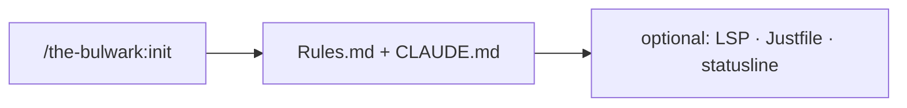
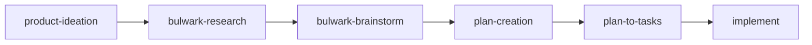
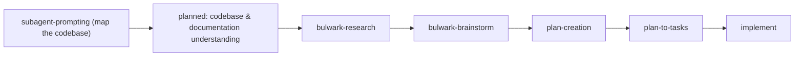
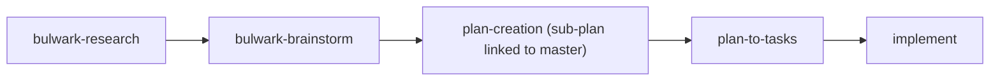
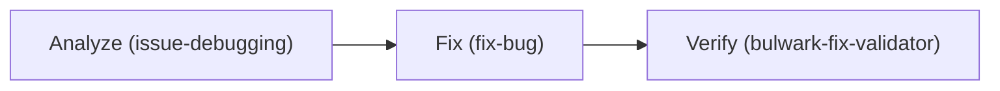

<p align="center">
  
</p>

<h1 align="center">The Bulwark</h1>

<p align="center">
  SDLC governance & enforcement for Claude Code.
  <br />
  Turn stochastic AI output into engineering-grade artifacts.
</p>

<p align="center">
  <a href="#quick-install">Install</a> &middot;
  <a href="#common-workflows">Workflows</a> &middot;
  <a href="#documentation">Docs</a> &middot;
  <a href="docs/guides/how-it-works.md">How it works</a> &middot;
  <a href="docs/roadmap.md">Roadmap</a>
</p>

<p align="center">
  <a href="https://www.npmjs.com/package/@qball-inc/the-bulwark"></a>
  <a href="https://www.npmjs.com/package/@qball-inc/the-bulwark"></a>
  <a href="https://github.com/QBall-Inc/plugins-market"></a>
  <a href="https://github.com/QBall-Inc/the-bulwark/releases/latest"></a>
  <a href="https://github.com/QBall-Inc/the-bulwark/commits/main"></a>
  <a href="LICENSE"></a>
  <a href="https://github.com/QBall-Inc/the-bulwark"></a>
</p>

---

## Latest stable release: v1.3.0

**v1.3.0** (2026-06-23) — *Fewer prompts, sharper reviews.* This release cuts permission-prompt friction and makes code review smarter about what it's reviewing. Every bundled skill and agent now pre-authorizes exactly the tools it needs, so routine operations stop interrupting you for approval. The `code-review` skill is now **language-aware** — it detects each changed file's language and runs only the checks that apply, backed by universal per-language recipes that skip gracefully when a tool isn't installed. And a new **opt-in permission hook** (off by default) can auto-approve tool calls scoped to Bulwark's own bundled files, for users who want an even quieter workflow.

See the [v1.3.0 release notes](https://github.com/QBall-Inc/the-bulwark/releases/tag/v1.3.0) and the full [CHANGELOG](CHANGELOG.md).

## What is The Bulwark?

The Bulwark is a [Claude Code plugin](https://docs.anthropic.com/en/docs/claude-code/plugins) that adds automated quality enforcement to your development workflow. It ships **30 skills, 15 custom agents, and 8 hooks** that run programmatic checks on every code change you make.

Claude Code is remarkably capable on its own — but capability without consistency is a problem. Without guardrails you get code that skips type checks, reviews that miss issues a single pass can't cover, test suites full of mocks that verify calls instead of behavior, and estimates that vary wildly between sessions. The Bulwark makes enforcement **automatic**: hooks run quality checks after every write, skills orchestrate single-focus multi-agent pipelines, and rules are injected at session start and enforced throughout. You don't have to remember to ask Claude to run tests or check types — it just happens.

**Who it's for:** builders who want to stay in the driver's seat while giving Claude semi-autonomy over structured workflows; teams that need repeatable, auditable AI-assisted development; users on Claude **Max or Enterprise** plans (the multi-agent pipelines are token-intensive — Pro Plus works for single-agent skills but hits rate limits on pipelines).

→ For the design (defense-in-depth, multi-agent pipelines), see **[How it works](docs/guides/how-it-works.md)** and **[architecture.md](docs/architecture.md)**.

## Quick install

Two ways to install. Pick whichever works for you.

```bash
# Option A — npm
claude /plugin install npm:@qball-inc/the-bulwark

# Option B — marketplace (one-time add, then install)
claude /plugin marketplace add QBall-Inc/plugins-market
claude /plugin install the-bulwark@qball-inc
```

After installing, restart your session and run the guided setup:

```
/the-bulwark:init
```

This walks you through Rules.md injection, CLAUDE.md configuration, and optional tooling (LSP, Justfile scaffolding, statusline), auto-detecting brownfield projects.

Full walkthrough + prerequisites: **[Getting started](docs/guides/getting-started.md)**.

Trouble installing? See the **[FAQ](docs/faq.md)**.

## Adoption

The Bulwark is growing through word of mouth. These charts auto-update daily — GitHub clone traffic (top) and npm downloads (bottom), each shown daily and as a cumulative running total. Data is self-snapshotted to a [`traffic-stats`](https://github.com/QBall-Inc/the-bulwark/tree/traffic-stats) branch because GitHub purges clone traffic after 14 days.

<table>
  <tr>
    <td align="center"></td>
    <td align="center"></td>
  </tr>
  <tr>
    <td align="center"></td>
    <td align="center"></td>
  </tr>
</table>

## Common workflows

Each workflow chains skills into a repeatable pipeline. The diagrams are the shape; the linked guides have the detail and full sample prompts.

**Initialize** — set up governance in any project.


```mermaid
flowchart LR
    A["/the-bulwark:init"] --> B[Rules.md + CLAUDE.md] --> C[optional: LSP · Justfile · statusline]
```

**Greenfield** — idea to executable plan. → [Feature development](docs/guides/feature-development.md)


```mermaid
flowchart LR
    A[product-ideation] --> B[bulwark-research] --> C[bulwark-brainstorm] --> D[plan-creation] --> E[plan-to-tasks] --> F[implement]
```

**Brownfield** — onboard onto an existing codebase. → [Feature development](docs/guides/feature-development.md)


```mermaid
flowchart LR
    A["subagent-prompting (map the codebase)"] --> B["planned: codebase & documentation understanding"] --> C[bulwark-research] --> D[bulwark-brainstorm] --> E[plan-creation] --> F[plan-to-tasks] --> G[implement]
```

> The **codebase & documentation understanding** skill is [planned](docs/roadmap.md), not yet shipped — today, use `subagent-prompting` to map the code first.

**New feature** — add to an existing plan. → [Research & planning](docs/guides/research-and-planning.md)


```mermaid
flowchart LR
    A[bulwark-research] --> B[bulwark-brainstorm] --> C["plan-creation (sub-plan linked to master)"] --> D[plan-to-tasks] --> E[implement]
```

**Analyze · Fix · Verify** — the issue lifecycle. → [Fixing bugs](docs/guides/fixing-bugs.md)


```mermaid
flowchart LR
    A["Analyze (issue-debugging)"] --> B["Fix (fix-bug)"] --> C["Verify (bulwark-fix-validator)"]
```

```
/the-bulwark:issue-debugging  Analyze the root cause of <symptom>; no code change.
/the-bulwark:fix-bug          Fix <bug> end-to-end and prove the fix with tests.
# Verify a fix you already applied: validate it against the debug report.
```

## Documentation

### Hooks

Eight hooks run automatically — no manual invocation. All use `${CLAUDE_PLUGIN_ROOT}` for path resolution, so they work wherever the plugin is installed.

| Hook | Event | What it does |
|------|-------|--------------|
| `enforce-quality.sh` | PostToolUse | Runs `just typecheck`/`lint`/`build` after every `Write`/`Edit`/`MultiEdit` on code; flags failures. Skips `tmp/`, `logs/`, `.claude/`, `docs/`. |
| `suggest-pipeline-stop.sh` | Stop | Suggests relevant review/audit pipelines; file-type-aware, per-file registry, post-fix grace period. |
| `inject-protocol.sh` | SessionStart | Injects the governance protocol; loads Rules.md; shows the activation banner. |
| `cleanup-stale.sh` | SessionStart | Deletes `logs/`+`tmp/` files older than 10 days (preserves `.gitkeep`). |
| `cleanup-review-registry.sh` | SessionStart | Wipes stale review-accumulator state so pipeline gating works across sessions. |
| `check-template-drift.sh` | SessionStart | Detects `CLAUDE.md`/`Rules.md` drift from canonical templates; feeds `init --update`. |
| `track-pipeline-start.sh` | SubagentStart | Logs pipeline invocation metadata for observability. |
| `track-pipeline-stop.sh` | SubagentStop | Logs pipeline completion metadata for observability. |

The Bulwark also ships one **optional, opt-in** hook (off by default) that auto-approves access to its *own* bundled files, so Claude Code stops re-prompting for assets you already trusted at install — handy if you don't run in auto mode. Full detail, safety boundaries, and how to enable it: **[hooks reference](docs/reference/hooks.md)**.

### Registries & guides

- **[Skill registry](docs/reference/skills.md)** — all 30 skills, grouped (product & strategy · code quality · setup & tooling · meta)
- **[Agent registry](docs/reference/agents.md)** — all 15 sub-agents, by pipeline
- **[Conventions](docs/reference/conventions.md)** — the CS / T / V / ID rules `Rules.md` enforces
- **Guides** — [Getting started](docs/guides/getting-started.md) · [How it works](docs/guides/how-it-works.md) · [Research & planning](docs/guides/research-and-planning.md) · [Feature development](docs/guides/feature-development.md) · [Fixing bugs](docs/guides/fixing-bugs.md)

## FAQ & troubleshooting

Common install and runtime issues — SSH clone failures, hooks not firing, `just` not found, rate-limited pipelines, and more — are covered in the **[FAQ](docs/faq.md)**. If your issue isn't there, [open an issue](https://github.com/QBall-Inc/the-bulwark/issues).

## Roadmap

Language-aware code review, an evaluation framework for skills/agents, a codebase-understanding skill for brownfield onboarding, enterprise traceability, and more. No timeline commitments — see **[docs/roadmap.md](docs/roadmap.md)** for the direction.

## Releases & changelog

- **Latest release**: [github.com/QBall-Inc/the-bulwark/releases/latest](https://github.com/QBall-Inc/the-bulwark/releases/latest)
- **Full version history**: [CHANGELOG.md](CHANGELOG.md) — follows [Keep a Changelog](https://keepachangelog.com/en/1.1.0/); the project adheres to [SemVer](https://semver.org/spec/v2.0.0.html)
- **npm**: [npmjs.com/package/@qball-inc/the-bulwark](https://www.npmjs.com/package/@qball-inc/the-bulwark)
- **Update an installed plugin**: `claude plugin update the-bulwark@qball-inc`

## Contributing

Issues and PRs are welcome. The Bulwark is developed in a private repo and mirrored here, so contributions follow a specific porting model — see **[CONTRIBUTING.md](CONTRIBUTING.md)** before opening a PR. The fastest way to help: [open an issue](https://github.com/QBall-Inc/the-bulwark/issues) for a bug or feature request.

## Credits

Built with [`just`](https://github.com/casey/just) (Casey Rodarmor) and [Claude Code](https://docs.anthropic.com/en/docs/claude-code) (Anthropic). Badges by [shields.io](https://shields.io).

## License

[MIT](LICENSE)

---

<p align="center">
  <em>If you find this useful, please give it a star — it helps others discover the project.</em>
  <br /><br />
  <a href="https://github.com/QBall-Inc/the-bulwark"></a>
</p>
