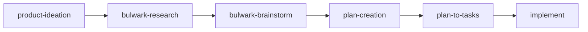
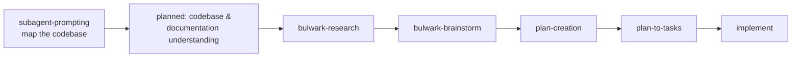
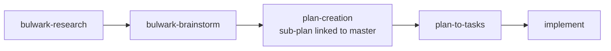

# Feature Development

The Bulwark chains research, brainstorming, and planning skills into end-to-end build workflows. Three shapes are common: **greenfield** (new project), **brownfield** (existing codebase), and **new feature** (addition to an existing plan).

## Greenfield projects

Start from an idea and work toward an executable plan.



[`product-ideation`](../skills/product-ideation.md) screens the idea (BUY/HOLD/SELL) → [`bulwark-research`](../skills/bulwark-research.md) explores the space from 5 viewpoints → [`bulwark-brainstorm`](../skills/bulwark-brainstorm.md) pressure-tests approaches → [`plan-creation`](../skills/plan-creation.md) produces phases/workpackages → [`plan-to-tasks`](../skills/plan-to-tasks.md) emits an executable `tasks.yaml` → you implement.

**Sample prompt:**

```
/the-bulwark:product-ideation A CLI that turns failing CI logs into a ranked
list of likely root causes for monorepos.
```

## Suggested brownfield workflow

For an existing codebase, prime a batch of sub-agents to parse and map the code before research and planning begin.



Today you can use [`subagent-prompting`](../skills/subagent-prompting.md) to spawn sub-agent batches that parse the codebase into a structured map. A dedicated **codebase & documentation understanding** skill is **planned** ([roadmap](../roadmap.md)) to make this step turnkey — it isn't shipped yet. The rest of the chain (research → brainstorm → plan → tasks → implement) is the same as greenfield.

**Sample prompt:**

```
Prime a batch of sub-agents (via subagent-prompting) to map this codebase —
entry points, module boundaries, and test layout — then summarize for planning.
```

## New feature

Add a feature to an existing project, linking the sub-plan to the master plan.



[`plan-creation`](../skills/plan-creation.md) supports parent/child plan linkage, and [`plan-to-tasks`](../skills/plan-to-tasks.md) carries the bidirectional reference into the task structure — so a feature's plan stays tied to the project's master plan.

**Sample prompt:**

```
/the-bulwark:bulwark-research Options for adding offline-first sync to our
existing notes app, then brainstorm and plan it as a sub-plan of the v2 roadmap.
```

## Mode selection (brainstorm & plan-creation)

Both [`bulwark-brainstorm`](../skills/bulwark-brainstorm.md) and [`plan-creation`](../skills/plan-creation.md) are dual-mode:

- **Sequential** (`--scoped` for brainstorm) — roles run one after another via the Task tool. Predictable, lower token cost. Best for well-understood topics.
- **Agent Teams** (`--exploratory` for brainstorm) — roles run concurrently and debate in real-time, with a Critic challenging assumptions as they form. Better convergence on contested topics, more token-intensive.

See [how-it-works.md](how-it-works.md#non-coding-workflows) for the mode-selection diagram.

## See also

- [Research & planning](research-and-planning.md) — the research/brainstorm/plan/tasks stages in depth
- [Fixing bugs](fixing-bugs.md) — analyze / fix / verify
- [Roadmap](../roadmap.md) — including the planned codebase-understanding skill
