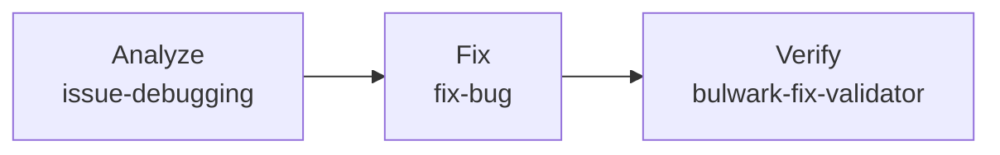
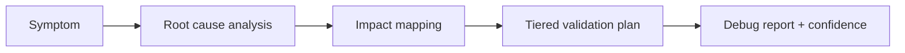
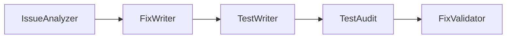

# Fixing Bugs

The Bulwark splits issue work into three distinct stages — **analyze**, **fix**, and **verify** — each backed by a dedicated skill or agent. You can run the full chain or use any stage on its own.



## Analyze an issue

**Skill:** [`issue-debugging`](../skills/issue-debugging.md) · **Agents:** [bulwark-issue-analyzer](../agents/bulwark-issue-analyzer.md), [bulwark-fix-validator](../agents/bulwark-fix-validator.md)

A systematic debugging methodology — root cause analysis, impact mapping, a tiered validation plan, and a confidence assessment. This stage produces a debug report and **does not change code**. Use it when you want to understand a problem before committing to a fix.



**Sample prompt:**

```
/the-bulwark:issue-debugging The statusline intermittently shows stale token
counts after a long pipeline run. Analyze the root cause and map the impact.
```

## Fix a bug

**Skill:** [`fix-bug`](../skills/fix-bug.md) · **Agents:** [issue-analyzer](../agents/bulwark-issue-analyzer.md), [implementer](../agents/bulwark-implementer.md), [fix-validator](../agents/bulwark-fix-validator.md)

The full 5-stage fix validation pipeline: analyze → implement → write tests → audit tests → validate fix. This is the end-to-end path when you want the issue fixed and the fix proven in one orchestrated run.



**Sample prompt:**

```
/the-bulwark:fix-bug enforce-quality.sh isn't catching MultiEdit operations —
bulk edits skip the typecheck/lint/build gate. Fix it and prove the fix.
```

## Verify a fix

**Agent:** [`bulwark-fix-validator`](../agents/bulwark-fix-validator.md)

Validates an already-applied fix against a debug report by executing the tiered test plan and assessing deployment confidence. Use this stage standalone when you (or Claude) have already made a fix manually and want it validated against the analysis — it's also the final stage of the `fix-bug` pipeline.

**Sample prompt:**

```
I've already patched the MultiEdit matcher in hooks.json. Validate the fix
against the debug report and tell me the confidence level.
```

## Choosing a stage

| You want to… | Use |
|--------------|-----|
| Understand a problem without changing code | `issue-debugging` (analyze) |
| Fix a bug end-to-end with tests + validation | `fix-bug` (fix) |
| Validate a fix you already applied | `bulwark-fix-validator` (verify) |

> Note: [`bulwark-verify`](../skills/bulwark-verify.md) is a different tool — it generates runnable verification *scripts* for components, not fix validation. See the [skill registry](../reference/skills.md).

## See also

- [How it works](how-it-works.md) — the defense-in-depth model behind these pipelines
- [Feature development](feature-development.md) · [Research & planning](research-and-planning.md)
