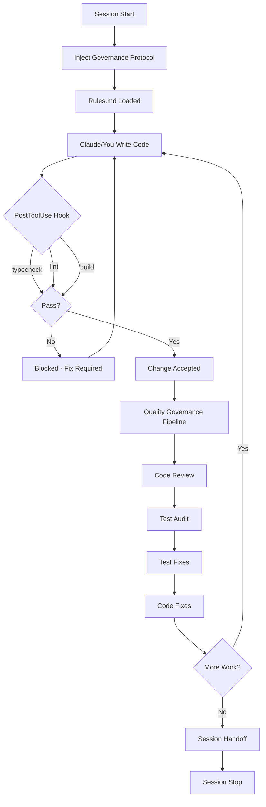
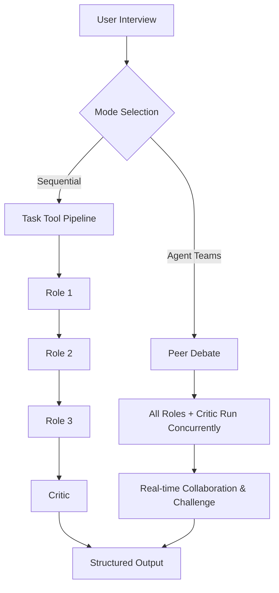

# How It Works

The Bulwark has different orchestration models for coding and non-coding workflows. This guide is the approachable walkthrough; for the deeper design rationale (defense-in-depth model, pipeline patterns, directory structure, technology stack) see [architecture.md](../architecture.md).

## Coding workflows

The coding side operates as a defense-in-depth system with three layers.

**Layer 1: Rules.** Injected into Claude's context at session start via the `SessionStart` hook. They define coding standards, testing requirements, and verification rules. Claude follows them because they're part of its active instructions, not because you asked nicely. See [conventions.md](../reference/conventions.md) for the full CS/T/V/ID rule set.

**Layer 2: Hooks.** Run after every `Write`, `Edit`, or `MultiEdit` operation. The `enforce-quality.sh` hook fires `typecheck`, `lint`, and `build` checks. If any fail, the change is flagged and Claude sees the errors. No silent failures. See [hooks.md](../reference/hooks.md) for all eight hooks.

**Layer 3: Pipelines.** Multi-agent workflows orchestrated by skills. A code review spawns 3-4 specialized agents (security, type safety, standards, synthesis). A test audit classifies every test file and checks for mock abuse. Each agent writes structured output to `logs/`, and only a summary returns to the main context. See the [skill registry](../reference/skills.md) and [agent registry](../reference/agents.md).

## Non-coding workflows

The Bulwark also orchestrates research, brainstorming, and planning workflows that don't involve writing code. These run entirely through multi-agent pipelines. (For end-to-end walkthroughs, see [research-and-planning.md](research-and-planning.md) and [feature-development.md](feature-development.md).)

**Research.** The `/the-bulwark:bulwark-research` skill spawns 5 parallel sub-agents, each researching a different viewpoint on your topic. After a short user interview, agents run concurrently and their findings merge into a single synthesis document. Useful for market research, competitor analysis, or deep dives on technical topics before you commit to a direction.

**Product Ideation.** The `/the-bulwark:product-ideation` skill spawns a full ideation team (6 agents) after a short user interview: market researcher, idea validator, competitive analyzer, segment analyzer, pattern documenter, and strategist. The pipeline produces a structured BUY/HOLD/SELL recommendation backed by evidence from each stage.

**Brainstorm & Plan Creation.** These two skills share a dual-mode orchestration pattern. You choose the mode based on how contested the topic is.

**Sequential mode.** Each role writes its output, then the next role reads it and builds on it. Structured, predictable, lower token cost. Best for well-understood topics where roles won't disagree much.

**Agent Teams mode.** All roles run concurrently and debate in real-time. The Critic challenges assumptions as they form, not after they've hardened. Better convergence on contested topics, more token-intensive. Best for novel problems where you want genuine adversarial pressure on every claim.

## See also

- [Getting started](getting-started.md) — install, prerequisites, and the `init` walkthrough
- [Conventions](../reference/conventions.md) · [Hooks](../reference/hooks.md) · [Skills](../reference/skills.md) · [Agents](../reference/agents.md)
- [architecture.md](../architecture.md) — the full architecture reference
