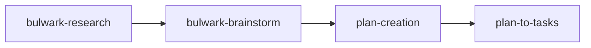

# Research & Planning

The Bulwark's non-coding pipelines turn an open question into structured, auditable artifacts. They run entirely through multi-agent orchestration — no code is written. This guide covers the four stages you'll chain most often: **research → brainstorm → plan → tasks**.



## Research

**Skill:** [`bulwark-research`](../skills/bulwark-research.md)

After a short interview, spawns 5 parallel sub-agents, each researching a different viewpoint on your topic. Findings merge into a single synthesis document. Useful for market research, competitor analysis, or technical deep dives before you commit to a direction.

**Sample prompt:**

```
/the-bulwark:bulwark-research Compare embedded key-value stores (RocksDB, LMDB,
SQLite) for a write-heavy, single-node telemetry agent.
```

For idea-stage work, [`product-ideation`](../skills/product-ideation.md) runs a 6-agent team (market researcher, idea validator, competitive analyzer, segment analyzer, pattern documenter, strategist) and produces a BUY/HOLD/SELL recommendation.

## Brainstorm

**Skill:** [`bulwark-brainstorm`](../skills/bulwark-brainstorm.md)

Role-based brainstorming in two modes:

- `--scoped` — 5 roles run sequentially via the Task tool. Focused, predictable, lower token cost.
- `--exploratory` — 4 roles run concurrently via Agent Teams with real-time peer debate; a Critic challenges assumptions as they form.

Choose `--exploratory` for contested or novel topics where you want genuine adversarial pressure; choose `--scoped` for well-understood ones.

**Sample prompt:**

```
/the-bulwark:bulwark-brainstorm --exploratory Should our telemetry agent batch
writes in-process or delegate to a sidecar? Pressure-test both.
```

## Plan creation

**Skill:** [`plan-creation`](../skills/plan-creation.md) · **Agents:** [PO](../agents/plan-creation-po.md), [Architect](../agents/plan-creation-architect.md), [Eng Lead](../agents/plan-creation-eng-lead.md), [QA/Critic](../agents/plan-creation-qa-critic.md)

A 4-role scrum team produces an implementation plan: scope and acceptance criteria (PO), system design and trade-offs (Architect), work breakdown, estimates, dependency graph and risk register (Eng Lead), and an adversarial APPROVE/MODIFY/REJECT review (QA/Critic). Dual-mode (Task tool or Agent Teams), and supports parent/child plan linkage for sub-plans.

**Sample prompt:**

```
/the-bulwark:plan-creation Build the batched-write path for the telemetry agent,
as a sub-plan of the v2 roadmap. Target a 2-week delivery.
```

## Plan → tasks

**Skill:** [`plan-to-tasks`](../skills/plan-to-tasks.md)

Transforms a `plan-creation` plan (`plan_v{N}.md`) into execution-ready structure: a `tasks.yaml` workpackage index plus per-WP YAML files, with bidirectional parent/child plan linkage. Parallel Sonnet sub-agents do the per-WP transform.

**Sample prompt:**

```
/the-bulwark:plan-to-tasks Convert the latest plan into tasks.yaml + per-WP files,
linked back to the v2 master plan.
```

## See also

- [How it works](how-it-works.md#non-coding-workflows) — the sequential vs Agent Teams mode-selection model
- [Feature development](feature-development.md) — greenfield/brownfield/new-feature chains that build on these stages
