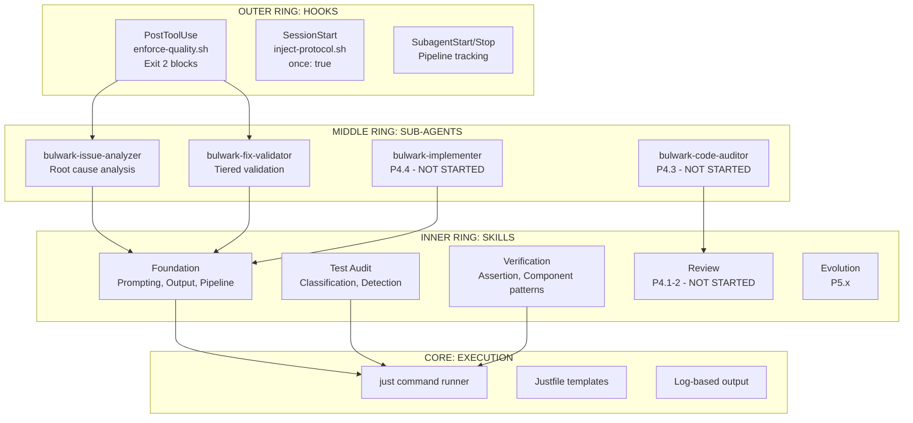
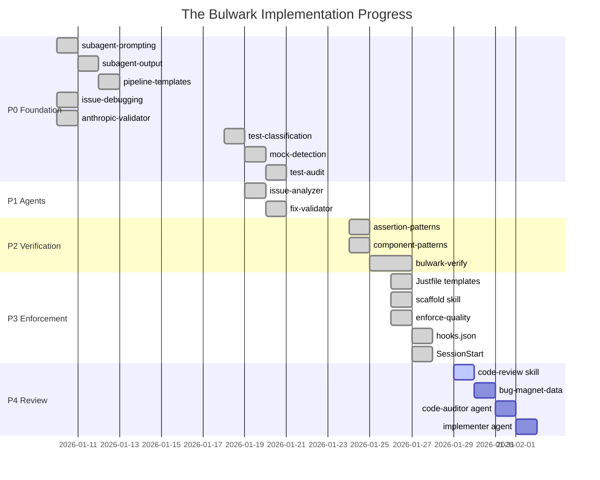
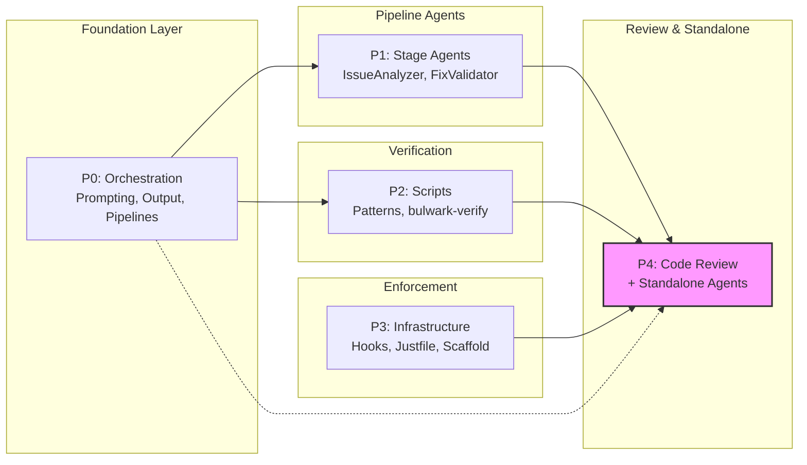
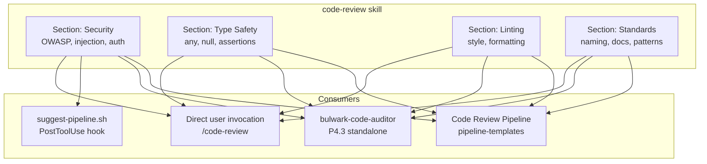
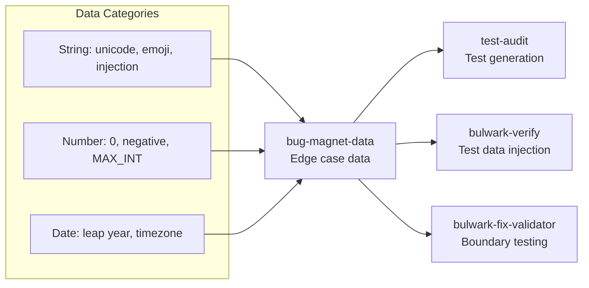
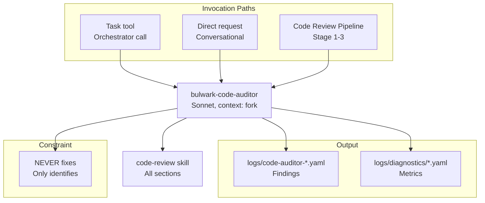
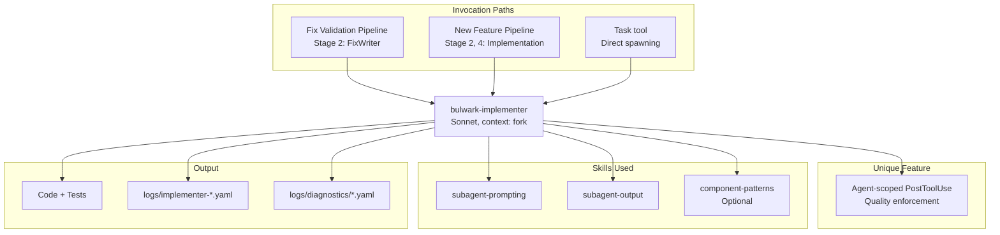
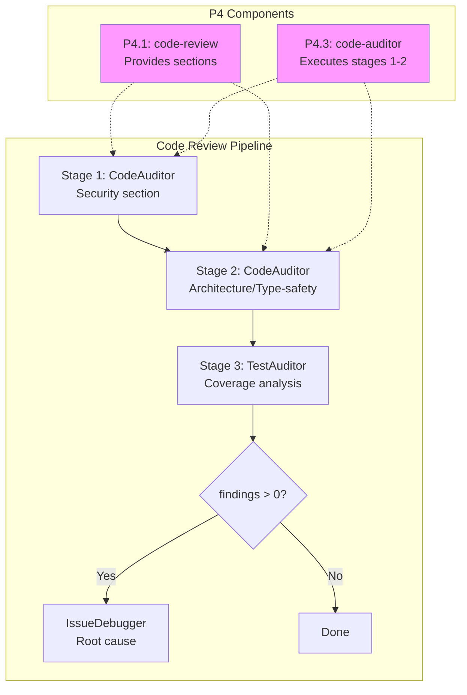
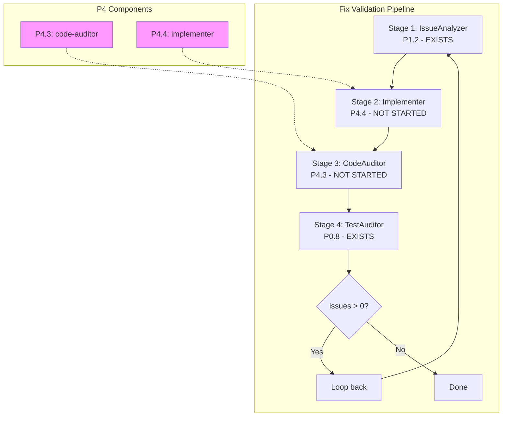

# P4 Phase Synthesis: Review Skills & Standalone Agents

*Session 29 - 2026-01-29*

This document synthesizes research from 5 sub-agents to understand how Phase 4 fits into The Bulwark holistically.

---

## 1. The Bulwark Vision (What We WANT)

### 1.1 Problem Being Solved

The Bulwark addresses five fundamental AI code generation issues:

| Problem | Description |
|---------|-------------|
| **Entropy Drift** | Code quality degrades as context fills |
| **Semantic vs Engineering** | Agents satisfy requests literally but fail engineering requirements |
| **Self-Review Bias** | Agents cannot objectively review their own code |
| **Mock-Heavy Testing** | Tests verify mocks, not actual behavior |
| **Fix-Declare-Done** | Fixes declared complete without verification |

### 1.2 Defense-in-Depth Architecture



### 1.3 All Planned Components

| Category | Completed | Not Started |
|----------|-----------|-------------|
| **Agents** | issue-analyzer, fix-validator | code-auditor (P4.3), implementer (P4.4) |
| **Skills** | 15 skills (P0-P3) | code-review (P4.1), bug-magnet-data (P4.2) |
| **Hooks** | PostToolUse, SessionStart, Subagent* | Agent-scoped hooks (P4.4) |
| **Infrastructure** | Justfile, scaffold, enforce-quality | - |

---

## 2. What Has Been ACTUALLY Implemented

### 2.1 Phase Completion Summary



### 2.2 P0: Foundation & Test Audit (COMPLETED)

**Delivers:** Standardized multi-agent orchestration patterns

| Skill | Purpose | Key Capability |
|-------|---------|----------------|
| subagent-prompting | 4-part prompt template | GOAL/CONSTRAINTS/CONTEXT/OUTPUT |
| subagent-output | Output format | WHY/WHAT/TRADE-OFFS/RISKS |
| pipeline-templates | Workflow patterns | 6 pre-defined F# pipelines |
| issue-debugging | Root cause analysis | 5 Whys, tiered validation |
| anthropic-validator | Standards compliance | Dynamic doc fetch + reviewer agent |
| test-classification | Test categorization | Haiku surface-level scan |
| mock-detection | T1-T4 violations | Sonnet deep analysis |
| test-audit | Orchestration | 3-stage pipeline + auto-rewrite |

**Key Artifacts:**
- 4 hook scripts (enforce-quality, track-pipeline-*, inject-protocol)
- 3 custom agents (issue-analyzer, fix-validator, standards-reviewer)
- Test fixtures for T1-T4 violations

### 2.3 P1: Pipeline Stage Agents (COMPLETED)

**Delivers:** Fix Validation pipeline implementation

| Component | Model | Capabilities |
|-----------|-------|--------------|
| **bulwark-issue-analyzer** | Sonnet | 5 Whys, hypothesis-driven debugging, impact mapping, debug reports |
| **bulwark-fix-validator** | Sonnet | Tiered validation, 4 test strategies, confidence assessment, execution checklist |
| **/fix-bug skill** | Orchestrator | Deterministic pipeline invocation, max 3 iterations |

**Key Learning:** Checklist enforcement (execution_attempts block) prevents LLM shortcuts.

### 2.4 P2: Verification Scripts (COMPLETED)

**Delivers:** Real behavior verification capabilities

| Skill | Purpose | Key Feature |
|-------|---------|-------------|
| assertion-patterns | T0-T4 transformations | 5 violation categories, fix strategies |
| component-patterns | Verification templates | 6 component types, 3 languages |
| bulwark-verify | Script generator | Main Context Orchestration, Sonnet sub-agent |

**Integration:** test-audit Step 7 now uses P2 skills for structured rewrites.

### 2.5 P3: Enforcement Infrastructure (COMPLETED)

**Delivers:** Quality gate automation

| Component | Function |
|-----------|----------|
| Justfile templates | 4 languages (Node, Python, Rust, Generic), 5 recipes each |
| bulwark-scaffold | Project detection, Justfile generation, hooks setup |
| enforce-quality.sh | Two-phase: quality checks → pipeline suggestion |
| hooks.json | Global PostToolUse, SessionStart (once: true), Subagent* |
| inject-protocol.sh | Governance protocol injection |

**Defects Fixed:** DEF-001, DEF-003, DEF-004, DEF-005 (path exclusions, recipe checks, Write vs Edit)

---

## 3. How P4 Fits In

### 3.1 Holistic Position



**P4's Role:**
1. **Completes the Review capability** - Adds security, type-safety, linting, standards sections
2. **Provides standalone agents** - Ad-hoc code auditing and implementation outside pipelines
3. **Enables full Code Review Pipeline** - Currently defined but not executable without P4.1

### 3.2 Individual P4 Items and Where They Plug In

#### P4.1: code-review skill (Unified with Sections)



**Dependencies:** None (builds on foundation skills)
**Used by:** P4.3, Code Review Pipeline, PostToolUse suggestion

#### P4.2: bug-magnet-data skill



**Dependencies:** None
**Used by:** Test generation, verification scripts, validation

#### P4.3: bulwark-code-auditor agent (Standalone)



**Dependencies:** P4.1 (code-review skill)
**Pattern:** Standalone ad-hoc agent (like anthropic-validator spawns bulwark-standards-reviewer)

#### P4.4: bulwark-implementer agent



**Dependencies:** P0.1, P0.2 (foundation skills)
**Unique:** Agent-scoped PostToolUse hook for quality enforcement

### 3.3 P4 in Pipeline Context





---

## 4. Task Brief Structure Recommendations

### 4.1 Analysis of P4 Tasks

| Task | Complexity | Dependencies | Coupling |
|------|------------|--------------|----------|
| P4.1 code-review | Medium | None | Low (standalone skill) |
| P4.2 bug-magnet-data | Low | None | Low (data skill) |
| P4.3 code-auditor | Medium | P4.1 | High (uses code-review) |
| P4.4 implementer | Medium | P0.1, P0.2 | Medium (uses foundation) |

### 4.2 Grouping Options

**Option A: Individual Briefs (4 documents)**
```
plans/task-briefs/
├── P4.1-code-review.md
├── P4.2-bug-magnet-data.md
├── P4.3-bulwark-code-auditor.md
└── P4.4-bulwark-implementer.md
```

*Pros:* Clear separation, independent implementation
*Cons:* Duplication of shared context, P4.1/P4.3 coupling not explicit

**Option B: Consolidated Brief (1 document)**
```
plans/task-briefs/
└── P4.1-4-review-skills-agents.md
```

*Pros:* Single source of truth, shows relationships
*Cons:* Large document, harder to track individual progress

**Option C: Logical Groupings (2 documents) - RECOMMENDED**
```
plans/task-briefs/
├── P4.1-2-review-skills.md      # Skills: code-review + bug-magnet-data
└── P4.3-4-standalone-agents.md  # Agents: code-auditor + implementer
```

*Pros:*
- Groups by artifact type (skills vs agents)
- P4.1/P4.2 are independent skills, can be implemented together
- P4.3/P4.4 are both agents with similar patterns (context: fork, Stop hooks)
- P4.3 depends on P4.1, so skills brief comes first
- Mirrors successful P0.6-8, P2.1-3, P3.1-3, P3.4-5 consolidation patterns

*Cons:* P4.3/P4.4 have different dependencies (P4.3→P4.1, P4.4→P0.x)

### 4.3 Recommendation: Option C (Logical Groupings)

Based on prior consolidation success (P0.6-8 Test Audit, P2.1-3 Verification, P3.1-3 Enforcement Core, P3.4-5 Enforcement Hooks), **Option C** aligns with established patterns.

**Brief 1: P4.1-2-review-skills.md**
- P4.1: code-review skill (unified with 4 sections)
- P4.2: bug-magnet-data skill (edge case data)
- Both are skills, no dependencies, can implement in sequence
- Estimated: 1 session

**Brief 2: P4.3-4-standalone-agents.md**
- P4.3: bulwark-code-auditor (uses P4.1)
- P4.4: bulwark-implementer (uses P0.x)
- Both are agents with context: fork, Stop hooks, diagnostics
- P4.3 must wait for P4.1 completion
- Estimated: 1-2 sessions

### 4.4 Alternative: Option A If...

Consider individual briefs if:
- You want to implement P4.2 and P4.4 in parallel (both have no P4 dependencies)
- You want maximum flexibility in task ordering
- Team members will work on different tasks simultaneously

---

## 5. Summary

### What's Implemented
- **P0**: 8 foundation skills providing orchestration patterns and test audit
- **P1**: 2 pipeline stage agents (IssueAnalyzer, FixValidator) + /fix-bug skill
- **P2**: 3 verification skills (assertion-patterns, component-patterns, bulwark-verify)
- **P3**: 5 enforcement components (Justfile, scaffold, hooks, SessionStart)

### What P4 Adds
- **P4.1**: Unified code-review skill with 4 sections (security, type-safety, linting, standards)
- **P4.2**: bug-magnet-data skill for edge case injection
- **P4.3**: Standalone bulwark-code-auditor agent for ad-hoc auditing
- **P4.4**: bulwark-implementer agent with agent-scoped quality hooks

### How It Fits
- P4.1 enables the Code Review Pipeline (currently defined but not executable)
- P4.3 provides standalone auditing outside pipelines (like anthropic-validator pattern)
- P4.4 completes Fix Validation Pipeline Stage 2 (currently uses /fix-bug workaround)
- P4.2 enhances test generation with boundary condition data

### Recommended Brief Structure
**Option C: Logical Groupings**
1. `P4.1-2-review-skills.md` - Skills (code-review + bug-magnet-data)
2. `P4.3-4-standalone-agents.md` - Agents (code-auditor + implementer)

---

## 6. Dependency Updates & Clarifications

*Added after Q&A research - Session 29*

### 6.1 Key Clarifications

#### bug-magnet-data Dependencies
- **Constraint:** Cannot reference a skill that doesn't exist - frontmatter `skills` array loads at invocation time
- **Implication:** Updates to test-audit, bulwark-verify, fix-validator must happen AFTER P4.2 implementation
- **Recommendation:** Treat these as optional P6 enhancements, not blocking P4 work

#### suggest-pipeline.sh Mechanism
- Uses **text-based instruction injection** via `additionalContext` JSON output
- Claude reads instructions ("Load skill: pipeline-templates") and invokes Skill tool
- Code Review Pipeline already exists in `pipeline-templates/references/code-review.md`
- Uses **section-based referencing** - each stage references a DIFFERENT section of the SAME skill

#### assertion-patterns / component-patterns Scope
- These skills are for **TEST verification only**, NOT production code review
- They should NOT be referenced by code-review type-safety/linting sections
- code-review uses static tools (`just typecheck/lint`) + LLM judgment, not test patterns

#### Type-Safety/Linting Review Flow
```
Phase 1: Static Analysis (Pre-filter)
├── Run `just typecheck` → Catches type errors
├── Run `just lint` → Catches style violations
└── Fast, deterministic, no token cost

Phase 2: LLM Review (Judgment-based)
├── Type safety: `any` patterns, null handling, unsafe assertions
└── Linting: naming semantics, pattern suitability, duplication
```

### 6.2 Existing Assets Requiring Updates

#### With P4.1 (code-review skill)

| Asset | Update Type | Details |
|-------|-------------|---------|
| `skills/pipeline-templates/SKILL.md` | Content | Verify role-based agent pattern documentation |
| `skills/pipeline-templates/references/code-review.md` | Content | Align section names, update prompts, specify output formats |

#### With P4.2 (bug-magnet-data skill)

| Asset | Update Type | Details |
|-------|-------------|---------|
| `skills/test-audit/SKILL.md` | Frontmatter + Content | Add to skills array, update Step 7 for edge case injection |
| `skills/bulwark-verify/SKILL.md` | Frontmatter + Content | Add to skills array, include edge cases in generated scripts |
| `agents/bulwark-fix-validator.md` | Frontmatter + Content | Add to skills array, validate against edge cases |

#### With P4.3 (bulwark-code-auditor agent)

| Asset | Update Type | Details |
|-------|-------------|---------|
| `skills/pipeline-templates/references/code-review.md` | Content | Add standalone alternative section |
| `skills/pipeline-templates/references/fix-validation.md` | Content | Evaluate Stage 5 code reviewer replacement |

#### With P4.4 (bulwark-implementer agent)

| Asset | Update Type | Details |
|-------|-------------|---------|
| `skills/pipeline-templates/references/fix-validation.md` | Content | Update Stage 2 from orchestrator to bulwark-implementer |
| `skills/pipeline-templates/references/new-feature.md` | Content | Update Stage 3 from general-purpose to bulwark-implementer |

### 6.3 Coordination Notes

1. **code-review.md** has updates for both P4.1 and P4.3 - coordinate in single edit session
2. **fix-validation.md** has updates for both P4.3 and P4.4 - coordinate updates
3. **bug-magnet-data consumers** (test-audit, bulwark-verify, fix-validator) - batch update after P4.2
4. All pipeline reference files should be updated before final pipeline-templates/SKILL.md verification

### 6.4 Updated Task Brief Structure

Given the dependency updates, the recommended brief structure remains **Option C** but with explicit update tasks:

**Brief 1: `P4.1-2-review-skills.md`**
- P4.1: Create code-review skill (4 sections)
- P4.1-U: Update pipeline-templates references for code-review
- P4.2: Create bug-magnet-data skill
- P4.2-U: Update test-audit, bulwark-verify, fix-validator (frontmatter + content)

**Brief 2: `P4.3-4-standalone-agents.md`**
- P4.3: Create bulwark-code-auditor agent
- P4.3-U: Update code-review.md standalone section, evaluate fix-validation.md Stage 5
- P4.4: Create bulwark-implementer agent
- P4.4-U: Update fix-validation.md Stage 2, new-feature.md Stage 3

---

*Research agents: a2c9046 (architecture), a32d176 (P0), a026102 (P1), ab8a8fa (P2), a2d0d3b (P3)*
*Dependency research agents: ab4d4b6 (bug-magnet), a8d205d (suggest-pipeline), a025389 (type-safety), af7d208 (P4 updates)*
