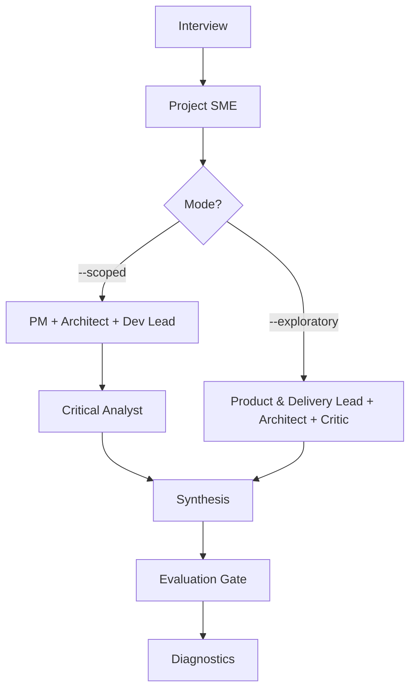

# bulwark-brainstorm

Role-based brainstorming with a dual-mode pipeline: sequential roles via Task tool, or concurrent peer debate via Agent Teams.

> [!WARNING]
> This skill launches 4-5 sub-agents and is token-intensive. Check your current token usage before triggering it. Run `/cost` or `/context` to see where you stand.

## Invocation and usage

```
/the-bulwark:bulwark-brainstorm <topic> [--research <synthesis-file>] [--scoped | --exploratory]
/the-bulwark:bulwark-brainstorm --doc <path> [--research <synthesis-file>] [--scoped | --exploratory]
```

**Arguments:**

| Argument | Description |
|----------|-------------|
| `<topic>` | Free-text topic description or problem statement |
| `--doc <path>` | Use a document as the topic source instead of inline text |
| `--research <file>` | Path to a research synthesis from `bulwark-research`. Strongly recommended. |
| `--scoped` | (default) Sequential pipeline with 5 roles via Task tool |
| `--exploratory` | Concurrent peer debate with 4 roles via Agent Teams. Requires `CLAUDE_CODE_EXPERIMENTAL_AGENT_TEAMS=1`. |

Two modes are available. `--scoped` runs roles one stage at a time through the Task tool. It is the default. `--exploratory` runs roles concurrently as Agent Teams teammates that debate and challenge each other in real time. It costs roughly 2x the tokens but produces better convergence on contested topics.

**Examples:**

```
/the-bulwark:bulwark-brainstorm "agent teams" --research artifacts/research/agent-teams/synthesis.md
```

```
/the-bulwark:bulwark-brainstorm --scoped "loop detection for autonomous agents"
```

```
/the-bulwark:bulwark-brainstorm --exploratory "new plugin architecture for distribution"
```

```
/the-bulwark:bulwark-brainstorm --doc plans/proposal.md --research artifacts/research/proposal/synthesis.md
```

After invocation, the skill conducts a short interview if the topic is ambiguous, then spawns a Project SME followed by 3-4 role agents depending on the mode. The final output includes individual role analyses, a synthesis document with consensus and divergence areas, and a diagnostic YAML log.

## Who is it for

- Teams evaluating whether to build something, before committing to implementation
- Anyone who wants structured multi-perspective analysis instead of a single-pass opinion
- Users who have completed a `bulwark-research` run and want to move from research to implementation planning
- Architects and leads who need to surface trade-offs and risks across product, technical, and delivery dimensions

## Who is it not for

- Initial topic research where the landscape is unknown. Run `/the-bulwark:bulwark-research` first.
- Quick technical questions that don't need multiple perspectives. Ask Claude directly.
- Code review or debugging. Use `/the-bulwark:code-review` or `/the-bulwark:issue-debugging`.
- Full implementation planning with phases, workpackages, and schedules. Use `/the-bulwark:plan-creation` after brainstorming.

## Why

Asking Claude to brainstorm a topic gives you one perspective. It generates ideas, lists pros and cons, and moves on. The analysis is shaped by whatever framing you provided and whatever the model's training data emphasizes. Blind spots stay blind.

Multi-role brainstorming fixes this by forcing the same topic through distinct professional lenses. A Project SME explores the codebase first and establishes what already exists. Then a Product Manager evaluates user value and scope. An Architect designs the technical approach. A Development Lead assesses feasibility and effort. A Critical Analyst challenges every assumption, checks cost-benefit, and issues a verdict: proceed, modify, defer, or kill.

The Critic is the key differentiator. In `--scoped` mode, the Critic runs last with full access to every prior analysis, so nothing escapes scrutiny. In `--exploratory` mode, the Critic participates from the start and challenges claims as they form, before positions harden. Both approaches produce better outcomes than a single-pass brainstorm because they surface disagreements, test assumptions, and force explicit trade-off decisions.

## How it works



**Interview.** The orchestrator parses your topic and optionally runs a clarifying interview (2-3 questions per round) if the problem statement is ambiguous. If `--research` was not provided, a warning is shown before proceeding.

**Project SME.** An Opus agent explores the codebase autonomously using Glob, Grep, and Read. No hardcoded paths. The SME identifies what exists, where integration points are, and what constraints apply. This output feeds all subsequent agents. Identical in both modes.

**Role analysis.** In `--scoped` mode, three role agents (PM, Architect, Dev Lead) run in parallel via Task tool, each receiving the SME output. In `--exploratory` mode, three Agent Teams teammates (Product & Delivery Lead, Architect, Critical Analyst) debate concurrently, challenging each other's positions in real time.

**Critical Analyst.** In `--scoped` mode, the Critic runs last and receives every prior output. In `--exploratory` mode, the Critic is already active from the start as an AT teammate.

**Synthesis.** The orchestrator reads all role outputs and writes a synthesis document covering consensus areas, divergence areas, and an implementation outline. A post-synthesis review with the user follows.

**Critical Evaluation Gate.** After synthesis, any user input is classified before incorporation. Preferences (scope, priority choices) are incorporated directly. Technical claims and architectural suggestions trigger optional follow-up validation with two focused agents (Architect + Critic) to verify feasibility before the synthesis is updated.

**Diagnostics.** A YAML file records pipeline metadata: mode used, agents spawned, token checkpoints, and completion status.

## Modes of operation

### --scoped (default)

Five roles run through a sequential pipeline via the Task tool. The Project SME runs first. Then three role agents (Product Manager, Technical Architect, Development Lead) run in parallel. The Critical Analyst runs last with access to all prior outputs. Best when the problem statement is well understood and you need focused, structured analysis.

### --exploratory

Four roles run through Agent Teams peer debate. The Project SME still runs first via Task tool. Then three AT teammates (Product & Delivery Lead, Technical Architect, Critical Analyst) are spawned concurrently and debate in real time. The Product Manager and Development Lead roles merge into a single Product & Delivery Lead. The Critic challenges positions as they form instead of waiting until the end. Best for novel or contested topics where genuine adversarial pressure improves convergence. Requires `CLAUDE_CODE_EXPERIMENTAL_AGENT_TEAMS=1` to be set in your environment.

### Role mapping

| Role | --scoped | --exploratory |
|------|----------|---------------|
| Project SME | Stage 2: solo first | Stage 2: solo first (identical) |
| Senior Product Manager | Stage 3: parallel | Merged into Product & Delivery Lead |
| Senior Technical Architect | Stage 3: parallel | Stage 3: AT teammate |
| Senior Development Lead | Stage 3: parallel | Merged into Product & Delivery Lead |
| Product & Delivery Lead | N/A | Stage 3: AT teammate |
| Critical Analyst | Stage 4: sequential last | Stage 3: AT teammate (active from start) |

## Output

All output is written to the project directory. Role analyses go to `logs/`, the synthesis goes to `artifacts/`.

| File | Contents |
|------|----------|
| `logs/brainstorm/{topic-slug}/01-project-sme.md` | Codebase context, integration points, constraints |
| `logs/brainstorm/{topic-slug}/02-product-manager.md` | User value, prioritization, scope boundaries (--scoped only) |
| `logs/brainstorm/{topic-slug}/02-product-delivery-lead.md` | Combined value, scope, feasibility, delivery (--exploratory only) |
| `logs/brainstorm/{topic-slug}/03-technical-architect.md` | System design, patterns, trade-offs |
| `logs/brainstorm/{topic-slug}/04-development-lead.md` | Feasibility, effort, risks, testing strategy (--scoped only) |
| `logs/brainstorm/{topic-slug}/04-critical-analyst.md` | Cost-benefit, assumption challenges, verdict (--exploratory only) |
| `logs/brainstorm/{topic-slug}/05-critical-analyst.md` | Cost-benefit, assumption challenges, verdict (--scoped only) |
| `artifacts/brainstorm/{topic-slug}/synthesis.md` | Merged analysis with consensus, divergence, and recommendations |
| `logs/diagnostics/bulwark-brainstorm-{timestamp}.yaml` | Pipeline execution metadata |

The synthesis document is the primary deliverable. The individual role analyses provide the evidence chain behind each recommendation.
