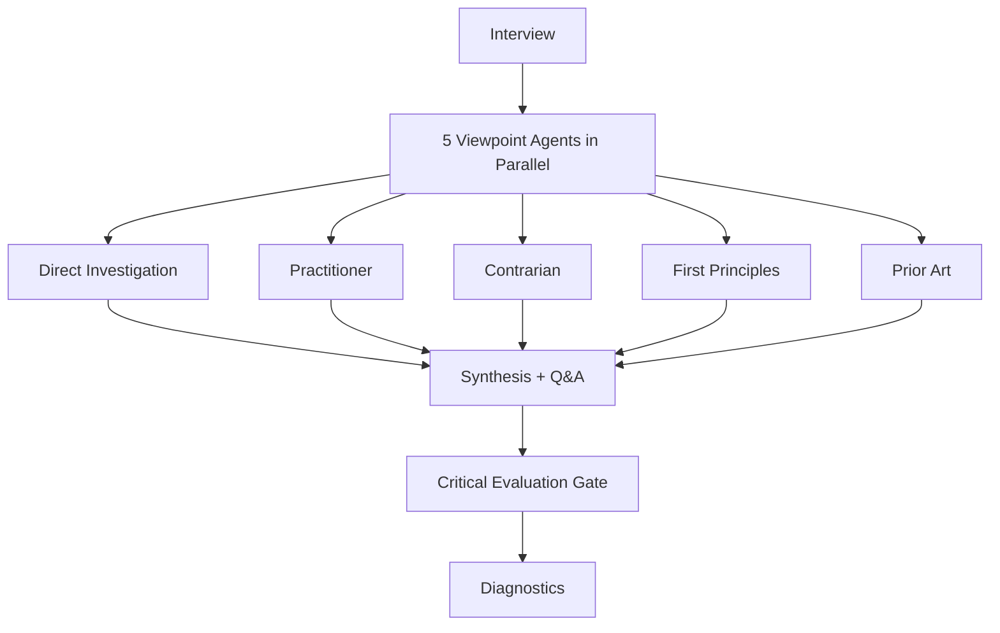

# bulwark-research

Spawns 5 parallel sub-agents to research a topic from distinct analytical viewpoints, then merges findings into a single synthesis document.

> [!WARNING]
> This skill launches 5 sub-agents and is token-intensive. Check your current token usage before triggering it. Run `/cost` or `/context` to see where you stand.

## Invocation and usage

```
/the-bulwark:bulwark-research <topic> [--context <file>]
/the-bulwark:bulwark-research --doc <path-to-document>
```

**Arguments:**

| Argument | Description |
|----------|-------------|
| `<topic>` | Free-text topic description or problem statement |
| `--context <file>` | Additional context file provided to all agents alongside the topic |
| `--doc <path>` | Use a document as the topic source instead of free text |

**Examples:**

```
/the-bulwark:bulwark-research agent teams and multi-agent orchestration patterns
```

```
/the-bulwark:bulwark-research loop detection in autonomous workflows --context docs/architecture.md
```

```
/the-bulwark:bulwark-research --doc plans/proposal.md
```

After invocation, the skill runs a short clarifying interview (if the topic is ambiguous), then launches 5 Sonnet agents in parallel. Each agent researches the topic from a different analytical viewpoint. The orchestrator reads all 5 reports, writes a merged synthesis document, and opens a post-synthesis Q&A round with a Critical Evaluation Gate. Output includes: 5 viewpoint analysis reports, a merged synthesis document, and a diagnostic YAML file.

## Who is it for

- Engineers and architects who need a structured deep-dive before committing to a technical direction
- Teams evaluating a technology, pattern, or approach where a single-pass answer is insufficient
- Anyone preparing input for a planning or brainstorming phase and wants grounded research first
- Leads doing pre-implementation research on unfamiliar domains

## Who is it not for

- Evaluating implementation feasibility for a specific proposal. Use `/the-bulwark:bulwark-brainstorm` instead.
- Quick fact lookups or single-question answers. Use web search or codebase exploration.
- Reviewing code. Use `/the-bulwark:code-review`.
- Debugging issues. Use `/the-bulwark:issue-debugging`.

## Why

Asking Claude a research question produces a single-perspective answer. It draws on training data, applies general reasoning, and returns a response. That response is often reasonable. It is also limited to one analytical frame. Blind spots stay blind. Failure modes go unmentioned. Historical context is omitted unless you specifically ask for it.

Five parallel viewpoints fix this. A Direct Investigation agent maps the mechanics and state of the art. A Practitioner agent surfaces real-world adoption patterns and operational gotchas. A Contrarian agent hunts for failure modes and hidden costs. A First Principles agent strips away buzzwords to find the core problem. A Prior Art agent traces historical predecessors and lessons from analogous patterns. All five run independently, so none of them anchor on another's framing. The synthesis merges all five into a single document where agreements reinforce and contradictions surface explicitly.

## How it works



**Interview.** The orchestrator parses your input. If the topic is ambiguous or under-specified, it asks 2-3 clarifying questions per round until scope is clear. Well-defined topics skip this step.

**Viewpoint analysis (5 Sonnet agents, parallel).** All five agents launch in a single message. Each receives the topic, any user-provided context, its viewpoint definition, and an output template. Agents write structured reports to `logs/research/{topic-slug}/`.

The five viewpoints:

| Viewpoint | Core question |
|-----------|--------------|
| Direct Investigation | What is this, how does it work, and what is the state of the art? |
| Practitioner | How do teams use this in production, and what are the real-world gotchas? |
| Contrarian | What failure modes do most people overlook, and when is this the wrong choice? |
| First Principles | What core problem does this solve, and what is the minimal viable version? |
| Prior Art / Historical | What similar patterns have existed before, and what lessons carry forward? |

**Synthesis.** The orchestrator reads all 5 reports and writes a merged synthesis document. Agreements are reinforced. Contradictions are surfaced explicitly. A post-synthesis Q&A round invites your input.

**Critical Evaluation Gate.** User input during Q&A is classified as Factual, Opinion, or Speculative. Factual and Opinion responses are incorporated directly. Speculative claims (unvalidated suggestions or hypotheses) trigger a prompt: you can approve a targeted follow-up research phase with 2 focused agents (Direct Investigation + Contrarian) to validate the claim, or incorporate it as-is with a low-confidence caveat.

**Diagnostics.** A YAML file records pipeline metadata: agent spawn results, interview rounds, token consumption, and output paths.

## Output

| File | Contents |
|------|----------|
| `logs/research/{topic-slug}/01-direct-investigation.md` | Definitions, mechanics, state of the art, key terminology |
| `logs/research/{topic-slug}/02-practitioner.md` | Adoption patterns, trade-offs, operational concerns, learning curves |
| `logs/research/{topic-slug}/03-contrarian.md` | Failure modes, hidden costs, alternatives, when-not-to-use analysis |
| `logs/research/{topic-slug}/04-first-principles.md` | Core problem decomposition, minimal viable version, essential vs. deferrable |
| `logs/research/{topic-slug}/05-prior-art.md` | Historical predecessors, evolution trajectories, applicable lessons |
| `artifacts/research/{topic-slug}/synthesis.md` | Merged synthesis across all 5 viewpoints with conflict resolution |
| `logs/diagnostics/bulwark-research-{timestamp}.yaml` | Pipeline execution metadata |

The synthesis document is the primary deliverable. The five viewpoint reports provide the evidence chain behind each finding.
