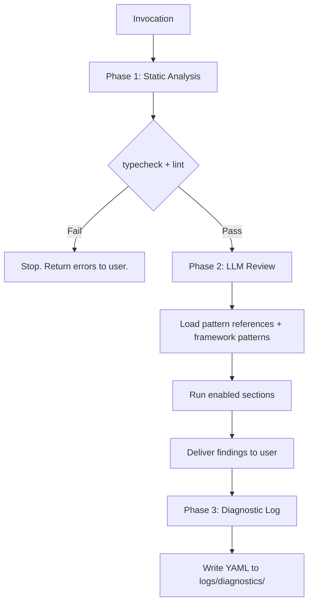

# code-review

Three-phase code review that runs static tools first, then applies LLM judgment across four specialized sections, then writes a diagnostic log.

## Invocation and usage

```
/the-bulwark:code-review [path] [flags]
```

**Arguments:**

| Argument | Description |
|----------|-------------|
| `[path]` | File or directory to review. Defaults to files in recent context if omitted. |

**Flags:**

| Flag | Description |
|------|-------------|
| `--quick` | Tiered review based on lines changed. Under 50 lines runs security only. 50 to 500 lines runs security and type safety. Over 500 lines runs all sections. |
| `--framework=<name>` | Override auto-detected framework. Accepts `react`, `express`, `django`, `angular`, `vue`, `flask`, `fastapi`, `generic`. |
| `--include-git-context` | Include git history metadata alongside complexity findings. Shows last modifier, commit message, and context notes. |
| `--section=<name>` | Run a single review section only. Accepts `security`, `type-safety`, `linting`, `standards`. |

**Examples:**

```
/the-bulwark:code-review src/auth/
```
Full review of the auth directory. All four sections run.

```
/the-bulwark:code-review src/api.ts --quick
```
Quick review. Sections are tiered by the number of lines changed in the file.

```
/the-bulwark:code-review src/ --section=security
```
Security section only. Useful when you want a focused vulnerability check without the full review.

```
/the-bulwark:code-review src/routes/ --framework=express
```
Full review with an explicit framework override. Loads Express-specific patterns instead of relying on auto-detection.

```
/the-bulwark:code-review src/components/ --include-git-context
```
Full review with git history attached to complexity findings. Helps distinguish intentional complexity from accidental.

Findings are grouped by severity with confidence levels (verified or suspected). A diagnostic YAML log is written after every review for pipeline observability.

## Who is it for

- Developers who want a structured review before merging a PR
- Teams that need security, type safety, and standards checks in a single pass
- Pipeline stages that invoke individual sections (e.g., `--section=security`) as part of a larger workflow
- Anyone reviewing unfamiliar code who wants a systematic sweep across multiple dimensions

## Who is it not for

- Auditing test quality. Use `/the-bulwark:test-audit` instead.
- Debugging runtime bugs or tracing failures. Use `/the-bulwark:issue-debugging` instead.
- Running tests. Use `just test`.
- Performance profiling. Requires runtime instrumentation that static review cannot provide.

## Why

A single-pass review asks one model to think about security, types, style, and conventions all at once. It works sometimes. Other times it fixates on style issues and misses an unvalidated SQL parameter, or flags a naming convention but overlooks an unsafe type assertion. Splitting the review into four independent sections, each with its own loaded pattern references and severity range, gives each concern dedicated attention. Security patterns check against OWASP Top 10. Type safety patterns look for `any` leaks and null gaps. Linting patterns flag structural issues that automated linters miss. Standards patterns verify adherence to project conventions.

Running typecheck and lint as a fail-fast gate before any LLM analysis serves two purposes. First, it avoids wasting tokens analyzing code that won't compile or that has obvious lint violations. Second, it eliminates a class of false positives where the LLM rediscovers issues that `tsc` or `eslint` would have caught anyway. The static tools are deterministic and fast. LLM judgment is reserved for the patterns tools cannot detect: business logic vulnerabilities, semantic naming quality, architectural drift, and convention adherence.

## How it works



**Phase 1: Static analysis.** Runs `just typecheck` and `just lint`. If either fails, the review stops and errors are returned immediately. No LLM tokens are spent on code that doesn't compile or pass lint.

**Phase 2: LLM review.** Each enabled section loads its pattern reference file from `references/` and applies section-specific analysis. If a framework is detected (or overridden via `--framework`), framework-specific patterns are also loaded. Findings are delivered to you grouped by severity.

**Phase 3: Diagnostic log.** A YAML file is written to `logs/diagnostics/code-review-{timestamp}.yaml` recording invocation details, static analysis results, sections run, framework detected, and finding counts by severity. Enables pipeline orchestration and audit trails.

### Review sections

| Section | What it covers | Severity range |
|---------|---------------|----------------|
| Security | OWASP Top 10, injection patterns, auth/authz logic, secrets exposure, CSRF, CORS | Critical to Important |
| Type Safety | Explicit and implicit `any` usage, null/undefined handling gaps, unsafe type assertions | Critical to Important |
| Linting | Cyclomatic complexity, semantic naming, deep nesting, code duplication, unclear control flow | Important to Suggestion |
| Coding Standards | Atomic principles (single responsibility, no magic, fail fast, clean code), documentation, pattern consistency | Important to Suggestion |

Each section has a defined boundary. Security does not flag type errors. Linting does not flag formatting issues (automated linters handle those). The boundaries prevent duplicate findings across sections.

### Framework auto-detection

Frameworks are detected from `package.json` dependencies, `requirements.txt`, or `pyproject.toml`. Supported frameworks: React, Next.js, Gatsby, Express, Fastify, Koa, Angular, Vue, Nuxt, Django, Flask, FastAPI. When a framework is detected, framework-specific patterns load automatically alongside core patterns. If no framework is detected, framework patterns are skipped entirely.

## Output

| File | Description |
|------|-------------|
| Console output | Findings grouped by severity (Critical, Important, Suggestion) with confidence levels, evidence traces, and fix recommendations |
| `logs/diagnostics/code-review-{timestamp}.yaml` | Diagnostic log with invocation metadata, static analysis results, and finding counts |

When invoked as a pipeline stage (via `--section`), output follows the pipeline template format with a gate pass/fail indicator for downstream orchestration.
