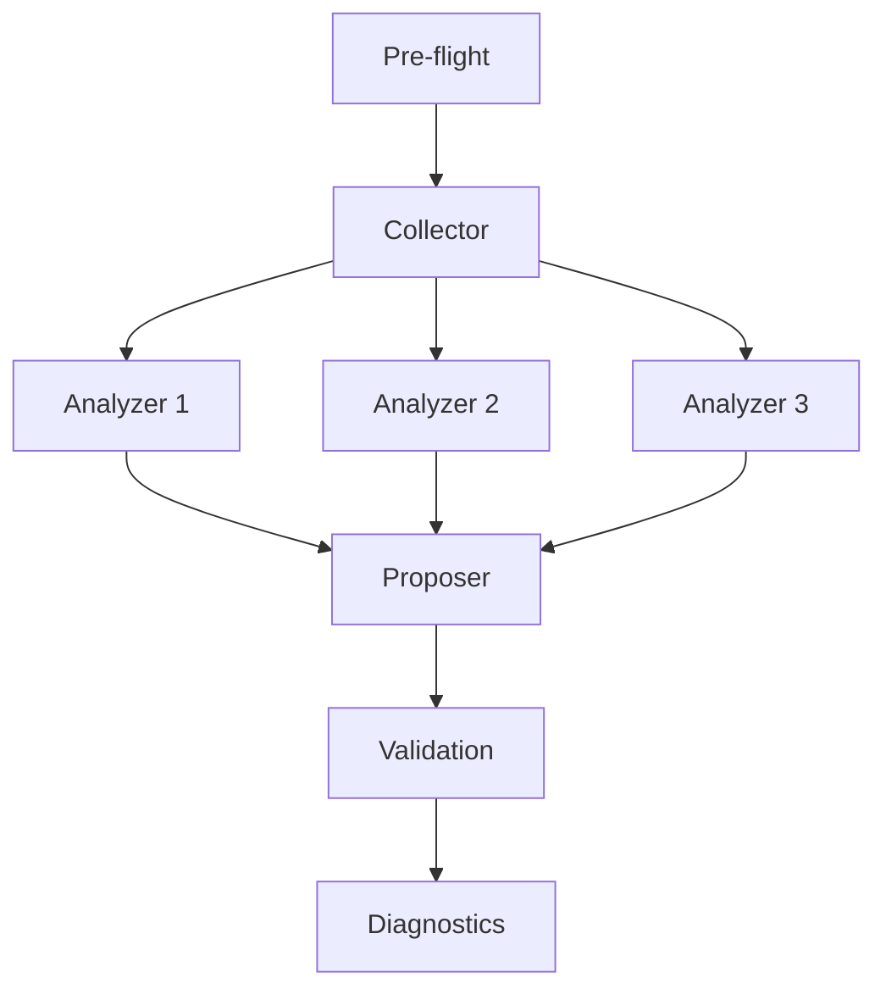

# continuous-feedback

Harvests learnings from session handoffs, memory files, and logs to propose concrete improvements to skills and agents with copy-paste ready patches.

## Invocation and usage

```
/the-bulwark:continuous-feedback <target-skill-or-path> [--sources <paths>] [--since <session-N>]
```

**Arguments:**

| Argument | Description |
|----------|-------------|
| `<target-skill-or-path>` | Skill name (e.g., `test-audit`) or path to a skill directory. If a directory containing multiple skills is targeted, the skill analyzes all detected skill types. |
| `--sources <paths>` | Custom input source paths (files or directories). Overrides default input sources. |
| `--since <session-N>` | Only collect learnings from session N onwards. Default: last 10 sessions. |

**Examples:**

```
/the-bulwark:continuous-feedback test-audit
```

Analyze accumulated learnings relevant to the test-audit skill.

```
/the-bulwark:continuous-feedback test-audit --since session-50
```

Restrict collection to learnings from session 50 onwards. Useful when earlier sessions cover a different project phase.

```
/the-bulwark:continuous-feedback skills/code-review/ --sources logs/research/
```

Target a skill by path and override input sources with a custom directory.

```
/the-bulwark:continuous-feedback .claude/skills/
```

Target a directory of skills. Every skill found in `.claude/skills/` gets its own analysis pass.

Output includes a collected learnings report, specialized analysis per improvement area, concrete improvement proposals with copy-paste ready patches, and diagnostic logs.

## Who is it for

- Maintainers of Claude Code skills or agents who want to evolve them based on real usage data
- Teams running multi-session projects where learnings accumulate in session handoffs and memory files
- Anyone who wants to close the loop between "lessons learned" and "lessons applied"
- Plugin authors looking for systematic improvement targets across their skill set

## Who is it not for

- Researching a topic from scratch. Use `/the-bulwark:bulwark-research`.
- Brainstorming new features or capabilities. Use `/the-bulwark:bulwark-brainstorm`.
- Reviewing code quality. Use `/the-bulwark:code-review`.
- Fixing a specific bug. Use `/the-bulwark:fix-bug`.

## Why

Skills and agents drift. The prompt that worked in session 10 may be missing patterns discovered in session 40. Session handoffs document defects, workarounds, and architecture decisions. Memory files accumulate observations about tool behavior and failure modes. But these learnings sit in files. They inform the next session's context, not the skill definitions themselves.

Manually reviewing 20 session handoffs to find improvement targets for a single skill is tedious and easy to do incompletely. This skill automates the harvest. It reads the accumulated record, classifies each learning by relevance, analyzes patterns through specialized lenses, and produces proposals that include the exact text to add or change. The output is concrete enough to apply without interpretation.

## How it works



**Pre-flight.** The orchestrator parses arguments, resolves the target skill path, determines which specializations apply, and verifies that enough input data exists (minimum 5 session handoffs). If the target is ambiguous, it asks for clarification.

**Collector (Sonnet, sequential).** A single agent reads session handoffs, memory files, and any custom sources. It extracts learning items, preserves their full content, and classifies each by category (defect pattern, architecture decision, framework observation, workflow improvement, tool behavior) and skill relevance. Classification uses LLM judgment, not keyword matching.

**Analyzers (1-3 Sonnet agents, parallel).** The number of analyzers is data-driven. If collected learnings match specific specializations (e.g., test patterns, code review patterns, pipeline orchestration), a specialized analyzer spawns for each. A general analyzer always runs, covering items not fully addressed by specialists. All analyzers launch in a single message.

**Proposer (Sonnet, sequential).** Reads all analyzer outputs and synthesizes them into concrete change proposals. Each proposal includes the exact file path, target section, change type, priority rating, source learnings, copy-paste ready content, rationale, and validation steps. Overlapping improvements across analyzers are deduplicated. Proposals targeting content that already exists in the skill are skipped.

**Validation.** The orchestrator reads proposals and annotates each with the appropriate verification steps: validator runs for skill assets, typecheck and lint for code files, configuration checks for config changes. Proposals are not applied automatically. They are presented for review with validation instructions.

**Diagnostics.** A YAML file records pipeline metadata: agent spawn results, analyzer specializations, token consumption, and output paths.

## Batch operations

Targeting a directory instead of a single skill name triggers batch analysis. For example, `/the-bulwark:continuous-feedback skills/` scans the directory for all skills it contains. Each skill gets its own collector, analyzer, and proposer pass. Proposals are grouped by skill in the output.

The same applies to `.claude/skills/` or any directory path containing multiple skill subdirectories.

## Output

| File | Contents |
|------|----------|
| `logs/continuous-feedback/{run-slug}/01-collect.md` | Collected learning items with source attribution and skill relevance tags |
| `logs/continuous-feedback/{run-slug}/02-analyze-{specialization}.md` | Specialized analysis per improvement area (1-3 files) |
| `logs/continuous-feedback/{run-slug}/03-proposal.md` | Concrete change proposals with priority, rationale, and copy-paste ready patches |
| `logs/continuous-feedback/{run-slug}/04-validation.md` | Validation annotations for each proposal |
| `logs/diagnostics/continuous-feedback-{timestamp}.yaml` | Pipeline execution metadata |

The proposal document is the primary deliverable. The collector and analyzer reports provide the evidence chain behind each proposed change.
