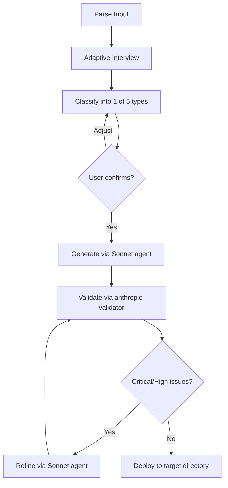

# create-skill

Generates Claude Code skills from a description or requirements document using an adaptive interview, structural classification, and iterative validation.

## Invocation and usage

```
/the-bulwark:create-skill <description-or-name> [--doc <requirements-path>]
```

**Arguments:**

| Argument | Description |
|----------|-------------|
| `<description-or-name>` | Free-text description of the desired skill, or a skill name to start from. |
| `--doc <path>` | Path to a requirements document. Interview answers are extracted from it instead of asking fresh. |

**Examples:**

```
/the-bulwark:create-skill a skill that audits dependency versions
```
Start from a description. The interview will ask follow-up questions to determine structure.

```
/the-bulwark:create-skill changelog-generator
```
Start from a name. The interview gathers purpose, context needs, and output format.

```
/the-bulwark:create-skill --doc plans/task-briefs/P5.4-create-skill.md
```
Start from a requirements document. Answers to the core interview questions are extracted from the document and presented for confirmation.

```
/the-bulwark:create-skill a pipeline skill that runs security checks then generates a report
```
Description that implies sub-agent orchestration. Classification will route to the pipeline template with generated agent definitions.

Before generating anything, the skill conducts an adaptive interview (1 to 2 rounds) to understand the skill's purpose, context needs, and complexity. Answers drive classification into one of 5 structural types: reference, direct-execution, sub-agent pipeline, research/interview, or context-fork. The output is a complete skill directory with SKILL.md, reference files, templates, and optionally sub-agent definitions. All files are generated in a working directory and deployed to `.claude/skills/` after validation passes.

## Who is it for

- Developers building new skills for The Bulwark or their own Claude Code projects
- Teams that want a consistent skill structure without memorizing Anthropic's conventions
- Anyone creating a multi-agent pipeline skill who needs agent definitions generated alongside the orchestrating SKILL.md
- First-time skill authors who benefit from the guided interview and automatic classification

## Who is it not for

- Creating standalone sub-agents without an orchestrating skill. Use `/the-bulwark:create-subagent` instead.
- Editing or refining an existing skill. Edit the SKILL.md directly.
- Validating an existing skill against Anthropic standards. Use `/the-bulwark:anthropic-validator` instead.
- Debugging skill activation or routing issues. Use `/the-bulwark:issue-debugging` instead.

## Why

Writing a SKILL.md from scratch requires knowing Anthropic's skill conventions, choosing the right context mode, deciding on sub-agent patterns, and structuring trigger tables and anti-trigger lists correctly. Getting any of these wrong leads to skills that don't activate reliably, produce inconsistent output, or break discovery due to multi-line descriptions. The adaptive interview removes guesswork by asking targeted questions and mapping answers to the right structural type automatically.

A Sonnet sub-agent handles file generation while the orchestrator handles classification and validation. After generation, the `anthropic-validator` skill runs against the output to catch convention violations before deployment. If critical or high issues are found, a refinement agent fixes them automatically (up to 2 retries). The result is a scaffold that follows Anthropic conventions out of the box, ready for you to customize with domain-specific content.

## How it works



**Pre-flight.** Arguments are parsed and the decision framework is loaded. If `--doc` is provided, interview answers are extracted from the document. Otherwise, 5 core questions are presented in a single round covering purpose, context needs, orchestration complexity, reference content volume, and output format. A follow-up round runs if complexity is detected.

**Classify.** Three independent decisions are made from the interview answers. Context mode (inline or fork). Sub-agent pattern (none, sequential, parallel, or Agent Teams). Supporting files (references, templates, scripts). These map to one of 5 structural templates. The classification is presented for confirmation before generation begins.

**Generate.** A Sonnet sub-agent receives the classification, selected template, content guidance, and the user's interview answers. It reads 1 to 2 existing skills of the same type from the codebase for structural reference, then produces all files in the working directory. For pipeline skills, sub-agent definition files are also generated.

**Validate.** The `anthropic-validator` skill runs against the generated output. Manual checks supplement it: single-line description, no unnecessary files, system-prompt register for any sub-agents.

**Refine.** Runs only if validation found critical or high issues. A Sonnet sub-agent fixes the specific issues identified. Validation re-runs after each attempt, with a maximum of 2 retries.

**Deploy.** Files move from the working directory to the target skill directory. Sub-agent files deploy to `.claude/agents/`. A post-generation summary lists all files, architectural decisions, validation results, and next steps.

### Structural types

| Type | Description |
|------|-------------|
| Reference | Knowledge or pattern content loaded as context by other skills. No executable logic. |
| Direct-execution | Single-purpose skill that runs inline without sub-agents. |
| Sub-agent pipeline | Orchestrates multiple sub-agents via the Task tool in sequential or parallel stages. |
| Research/interview | Conducts a user interview, then spawns research agents with reasoning depth controls. |
| Context-fork | Runs in an isolated context (`context: fork`) for multi-step work that doesn't need conversation history. |

## Output

| Path | Description |
|------|-------------|
| `tmp/create-skill/{name}/` | Working directory during generation and validation. Removed after deployment. |
| `.claude/skills/{name}/SKILL.md` | The generated skill definition with frontmatter, trigger tables, stage definitions, and error handling. |
| `.claude/skills/{name}/references/` | Domain-specific reference files, decision frameworks, or content guidance. Created when the classification calls for supporting references. |
| `.claude/skills/{name}/templates/` | Output templates for structured formats (YAML, Markdown). Created when the skill produces structured output. |
| `.claude/skills/{name}/scripts/` | Deterministic scripts for tasks better handled by code than LLM judgment. Created when the classification identifies scriptable operations. |
| `.claude/agents/{name}-{stage}.md` | Sub-agent definitions for pipeline skills. One file per pipeline stage. Only created for the sub-agent pipeline type. |
| `logs/diagnostics/create-skill-{timestamp}.yaml` | Diagnostic log recording input, interview rounds, classification decisions, generation details, and validation results. |
