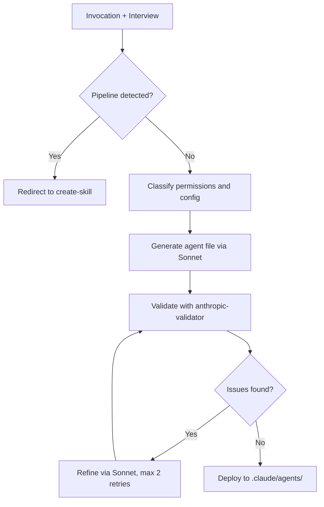

# create-subagent

Generates single-purpose Claude Code sub-agents from a description, name, or requirements document.

## Invocation and usage

```
/the-bulwark:create-subagent <description-or-name> [--doc <requirements-path>]
```

**Arguments:**

| Argument | Description |
|----------|-------------|
| `<description-or-name>` | Free-text description of the desired agent, or an agent name to start from. |
| `--doc <path>` | Path to a requirements document. Interview answers are extracted from the document instead of asked interactively. |

**Examples:**

```
/the-bulwark:create-subagent a code security reviewer that checks for OWASP vulnerabilities
```
Start from a description. The skill interviews you to determine tool permissions, model class, and output format, then generates the agent.

```
/the-bulwark:create-subagent market-analyst
```
Start from a name. The interview fills in the agent's identity, mission, and tooling requirements.

```
/the-bulwark:create-subagent --doc plans/task-briefs/P4.4-implementer.md
```
Start from a requirements document. The skill extracts interview answers from the document and asks you to confirm before proceeding.

After invocation, the skill conducts an adaptive interview (1-2 rounds) to understand the agent's identity and mission. Questions cover what the agent does, what tools it needs, whether it requires structured diagnostic output, and what permission model to use. If the interview reveals multi-stage or pipeline needs, the skill redirects you to `/the-bulwark:create-skill` instead.

Sub-agents are single-purpose workers invoked via `Task(subagent_type=...)`. They run in a forked context, perform one focused task, and return results. They cannot spawn other sub-agents. Pipeline orchestration belongs in skills, not agents.

The output is a complete agent definition file with system prompt, tool permissions, and model specification, validated against Anthropic standards before deployment.

## Who is it for

- Developers adding a dedicated sub-agent to a skill pipeline
- Anyone who needs a new Task tool agent and wants convention-compliant scaffolding
- Teams building multi-agent workflows where each agent needs a well-defined identity and permission boundary

## Who is it not for

- Creating skills or pipeline orchestration. Use `/the-bulwark:create-skill`, which generates both the orchestrating skill and its sub-agent files.
- Editing existing agents. Edit the agent file directly in `.claude/agents/`.
- Validating an existing agent against Anthropic conventions. Use `/the-bulwark:anthropic-validator`.
- Creating Agent Teams leads or multi-role workflows. Use `/the-bulwark:create-skill` with the research template.

## Why

Writing a sub-agent from scratch means getting the frontmatter format right, choosing appropriate tool permissions, writing in system-prompt register (not task-instruction register), including permission setup documentation, and staying under the line budget. Each of these has documented conventions that are easy to miss. The interview determines the right tool permissions and model selection based on what the agent actually needs to do, not what seems reasonable at first glance.

After generation, the skill runs `/the-bulwark:anthropic-validator` automatically. The validator catches convention issues (multi-line descriptions that break skill discovery, missing permission sections, wrong register) before the agent is ever invoked. The single-purpose constraint is enforced by design: if the interview reveals multi-stage needs, the pipeline redirects to `create-skill` instead of producing an agent that tries to do too much.

## How it works



**Interview.** Parses the input (description, name, or `--doc` path) and runs an adaptive interview. Five core questions cover identity, tools, complexity, diagnostics, and permissions. If answers suggest pipeline or multi-stage orchestration, the skill stops and redirects to `create-skill`.

**Classification.** Two decisions are made from the interview answers. First, tool permissions: full access or a restricted list. Second, supporting configuration: whether the agent needs diagnostic output schemas, quality gate guidance, or command allow/deny lists.

**Generation.** A Sonnet sub-agent produces the agent file using the single-agent template, agent conventions reference, and content guidance. The agent writes in system-prompt register, opening with an identity statement rather than task steps. Generation happens in a working directory (`tmp/create-subagent/{name}/`) to avoid approval prompts on `.claude/` edits.

**Validation.** The orchestrator invokes `/the-bulwark:anthropic-validator` on the generated file and runs manual checks (single-line description, system-prompt register, permissions section present).

**Refinement.** If the validator finds critical or high issues, a second Sonnet sub-agent fixes them. Up to 2 retry cycles. If issues persist after retries, the agent is deployed with caveats noted.

**Deployment.** The validated file moves from the working directory to `.claude/agents/{name}.md`. The working directory is cleaned up. A post-generation summary presents architectural decisions, validation results, permission setup steps, and next steps for customization.

## Output

| File | Description |
|------|-------------|
| `.claude/agents/{name}.md` | The generated agent definition. Includes frontmatter (name, description, model, tools), system prompt, protocol, output format, and permissions setup section. |
| `logs/diagnostics/create-subagent-{timestamp}.yaml` | Diagnostic log recording interview answers, classification decisions, validation results, and outcome. |

During generation, files are written to `tmp/create-subagent/{name}/`. After validation passes, the agent file is deployed to `.claude/agents/{name}.md` and the working directory is removed. The generated file is a scaffold. Review the identity sections, adjust tool permissions in `.claude/settings.json`, and add project-specific protocol steps before using it in production.
