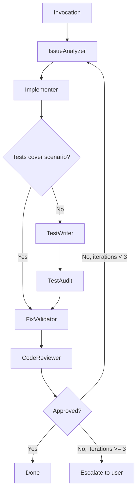

# fix-bug

Five-stage fix validation pipeline that investigates a bug, implements the fix, conditionally writes and audits tests, validates the fix against the original analysis, and reviews the result.

## Invocation and usage

```
/the-bulwark:fix-bug <path> [description]
```

**Arguments:**

| Argument | Description |
|----------|-------------|
| `<path>` | Required. Path to the file containing the bug. |
| `[description]` | Optional. A description of the issue. Recommended for better root cause analysis. Without it, the analyzer infers the problem from code alone. |

**Examples:**

```
/the-bulwark:fix-bug src/auth/login.ts "Users report login fails for new accounts"
```
Full pipeline with a clear bug description. The analyzer uses the description to narrow root cause analysis.

```
/the-bulwark:fix-bug src/api/routes.ts
```
No description provided. The issue analyzer examines the file and surrounding context to identify the problem.

```
/the-bulwark:fix-bug src/cart/checkout.ts "Cart total shows NaN when discount code is applied twice"
```
Specific reproduction scenario. Helps the analyzer map impact and build a targeted validation plan.

```
/the-bulwark:fix-bug tests/fixtures/fix-validator/simple-fix/ "Cannot read property displayName of undefined"
```
Path points to a test fixture directory. Useful when the bug is already isolated in a test case.

The pipeline produces a debug report with root cause analysis and tiered validation plan, the implemented fix, conditionally written tests and test audit results, a fix validation report with confidence assessment, and a code review of the fix.

## Who is it for

- Developers investigating a bug they can reproduce but haven't diagnosed yet
- Teams that want a structured audit trail from root cause through fix validation
- Pipeline stages that need deterministic fix-then-verify execution instead of ad-hoc patching
- Anyone who wants test coverage verified (and written if missing) as part of the fix process

## Who is it not for

- Simple typo corrections or one-line fixes. Edit the file directly.
- Refactoring without a reported bug. Use `/the-bulwark:code-review` instead.
- Adding new features. Use `/the-bulwark:plan-creation` to plan, then implement.
- Performance optimization or architectural changes. Use `/the-bulwark:bulwark-research` to analyze options first.

## Why

Asking Claude to "fix this bug" in a single pass produces a patch. Sometimes the patch works. Other times it addresses a symptom while the root cause persists, or it fixes the immediate problem but breaks an adjacent code path. A five-stage pipeline catches more because each stage has a single focus. The issue analyzer maps root cause and impact before anyone writes code. The implementer writes the fix with quality checks after every edit. The test writer only fires if existing tests don't cover the bug scenario. The test audit verifies new tests check real behavior, not mock interactions. The fix validator compares the result against the original debug report.

Root cause analysis before fixing is the key differentiator. Without it, fixes tend to patch the point of failure rather than the source of the defect. The conditional test path avoids unnecessary test duplication: if tests already cover the scenario, they're skipped. If the test writer does run, new tests go through a T1-T4 compliance audit to catch mock abuse before it enters the codebase. At the end, the code reviewer evaluates the complete fix. If the reviewer rejects it, the pipeline loops back to the issue analyzer with feedback from the failed attempt. This loop runs up to 3 iterations before escalating to you.

## How it works



**Stage 1: IssueAnalyzer** ([bulwark-issue-analyzer](../agents/bulwark-issue-analyzer.md), Sonnet). Analyzes the bug to produce a debug report. Performs root cause analysis, maps impact across the codebase, and builds a tiered validation plan. The debug report is written to `logs/debug-reports/` and feeds every subsequent stage.

**Stage 2: Implementer** ([bulwark-implementer](../agents/bulwark-implementer.md), Opus). Writes the fix based on the debug report. Runs quality checks (typecheck, lint, build) after every file edit. Only fixes the identified issue. Does not refactor surrounding code or add unrelated improvements.

**Stage 3: TestWriter** (conditional, Opus). Fires only if the debug report indicates existing tests do not cover the bug scenario. Writes tests that verify the specific fix. Follows T1-T4 testing rules: no mocking the system under test, verification of observable output.

**Stage 3b: TestAudit** (conditional). Runs if any test files were created or modified in Stage 2 or Stage 3. Audits new tests for T1-T4 compliance using mock detection analysis. T1 violations (mocking the system under test) trigger a rewrite. T2-T4 violations are logged as warnings.

**Stage 4: FixValidator** ([bulwark-fix-validator](../agents/bulwark-fix-validator.md), Sonnet). Validates the fix against the original debug report. Executes the tiered test plan from Stage 1. Produces a confidence assessment (HIGH, MEDIUM, or LOW) with a proceed or revise recommendation.

**Stage 5: CodeReviewer** (general-purpose agent, Sonnet). Final review of the complete fix. Checks that the fix addresses the root cause, tests verify the bug scenario, no new issues were introduced, and validation confidence is acceptable. Issues an approved or rejected verdict.

If rejected, the pipeline loops back to Stage 1 with the reviewer's feedback and previous validation results. After 3 failed iterations, the pipeline stops and escalates to you with a summary of all attempts.

## Output

| File | Description |
|------|-------------|
| `logs/debug-reports/{issue-id}-{timestamp}.yaml` | Debug report from the issue analyzer. Contains root cause analysis, impact mapping, and tiered validation plan. |
| `logs/implementer-{id}-{timestamp}.yaml` | Implementation report from the fix writer. Lists files modified, fix description, and quality gate results. |
| `logs/validations/fix-validation-{issue-id}-{timestamp}.yaml` | Validation report from the fix validator. Contains confidence assessment and proceed/revise recommendation. |
| Console output | Stage-by-stage progress with root cause summary, files modified, test counts, confidence level, and approval decision. |
