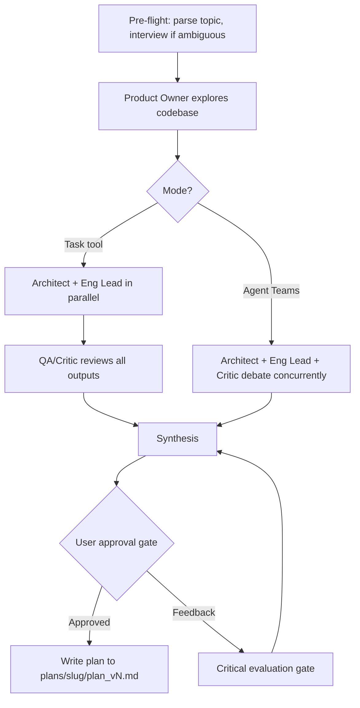

# Plan creation

Create structured implementation plans using a 4-role scrum team: Product Owner, Technical Architect, Engineering & Delivery Lead, and QA/Critic.

## Invocation and usage

```
/the-bulwark:plan-creation <topic-or-prompt> [--research <synthesis-file>]
/the-bulwark:plan-creation --doc <path-to-document> [--research <synthesis-file>]
```

### Arguments

| Argument | Required | Description |
|----------|----------|-------------|
| `<topic-or-prompt>` | Yes (or `--doc`) | Free-text topic description or problem statement. |
| `--doc <path>` | Yes (or topic) | Use a document as the topic source instead of inline text. |
| `--research <synthesis-file>` | No | Path to a research synthesis from `/the-bulwark:bulwark-research` or `/the-bulwark:bulwark-brainstorm`. Strongly recommended. Plan quality is significantly higher when preceded by research. |

### Examples

Create a plan from a topic with prior research:

```
/the-bulwark:plan-creation "add user authentication" --research logs/research/auth/synthesis.md
```

Create a plan from a document:

```
/the-bulwark:plan-creation --doc plans/proposal.md
```

Create a plan without prior research (the skill will warn you and ask to confirm):

```
/the-bulwark:plan-creation "migrate database to PostgreSQL"
```

Create a plan for a directory or feature area:

```
/the-bulwark:plan-creation "refactor the billing module" --research logs/research/billing/synthesis.md
```

### Dual-mode operation

The skill supports two execution modes. You do not need to choose upfront. If Agent Teams is available (the `CLAUDE_CODE_EXPERIMENTAL_AGENT_TEAMS=1` env var is set), the skill detects it and asks which mode you prefer.

- **Task tool mode** (default): Sequential pipeline. Lower token cost, predictable execution.
- **Agent Teams mode** (opt-in): Concurrent peer debate. Higher token cost, better convergence on contested topics.

Both modes produce the same output format. See [Modes of operation](#modes-of-operation) for details.

### Plan versioning

Plans are versioned automatically and stored in `plans/{slug}/`. The skill checks for existing plans before writing.

| Scenario | Version | Example path |
|----------|---------|--------------|
| First plan for a topic | `v1` | `plans/add-auth/plan_v1.md` |
| Minor revision (iterating on current plan) | `v1.1`, `v1.2` | Approval gate feedback leads to revision |
| Major version (full re-run or pivot) | `v2`, `v3` | New invocation for same slug |

When the version is ambiguous (re-run vs. revision), the skill asks.

### What it produces

Each invocation generates diagnostic logs, individual role analyses from each agent, an interim synthesis, and a final implementation plan. The plan is broken into phases (initiatives), workpackages (epics), and tasks (user stories) with acceptance criteria and delivery estimates.

## Who is it for

- Teams planning multi-session features or refactors that need structured delivery schedules.
- Developers who want implementation plans with realistic effort estimates and dependency graphs.
- Projects where requirements, architecture, and delivery need to be cross-validated before coding starts.

## Who is it not for

- Quick technical questions. Ask Claude directly.
- Initial topic research before you know what to build. Use [`bulwark-research`](bulwark-research.md) first.
- Feasibility brainstorming on open-ended ideas. Use [`bulwark-brainstorm`](bulwark-brainstorm.md).
- Code review or debugging. Use [`code-review`](code-review.md) or [`issue-debugging`](issue-debugging.md).

## Why

Asking Claude to "create a plan" produces a single-perspective document. It tends to be optimistic, internally consistent, and unchallenged. Requirements bleed into architecture. Estimates lack grounding. Edge cases go unexamined.

A 4-role scrum team fixes this by separating concerns. The Product Owner explores the codebase and defines what needs to happen without making architectural decisions. The Technical Architect designs the system without estimating effort. The Engineering and Delivery Lead produces work breakdown structures, estimates, and dependency graphs without redesigning the architecture. Each role works from the same inputs but has a different focus.

The QA/Critic is the key differentiator. It receives all three prior outputs and adversarially challenges assumptions, stress-tests estimates, and cross-references requirements against architecture against delivery. It issues an APPROVE, MODIFY, or REJECT verdict. Plans that pass this gate have been pressure-tested from four independent angles before you see them.

## How it works



**Pre-flight.** The skill parses the topic from the argument, `--doc` flag, or an interactive interview. If the problem statement is ambiguous, it asks 2-3 clarifying questions per round until scope is clear. It loads research synthesis if `--research` was provided. Mode detection happens here: if Agent Teams is available, you choose between modes.

**Product Owner.** An Opus agent autonomously explores the codebase using search and read tools. It produces a requirements analysis covering scope, acceptance criteria, and user value. No hardcoded file paths. The PO discovers what is relevant on its own.

**Scrum team analysis.** In Task tool mode, the Architect and Eng Lead run in parallel, followed by the QA/Critic sequentially. In Agent Teams mode, all three run concurrently and challenge each other in real-time via peer messaging.

**Synthesis.** The orchestrator reads all four agent outputs, resolves conflicts, and composes a draft plan using structured templates. The plan includes phases, workpackages, tasks, milestones, dependencies, risks, and kill criteria.

**Approval gate.** The draft plan is presented for your review. You can approve it, request changes, or provide feedback. Feedback passes through a Critical Evaluation Gate.

**Critical evaluation gate.** When you provide feedback on the draft plan, each response is classified as a preference, a technical claim, or an architectural suggestion. Preferences (scope, priority, UX choices) are incorporated directly. Technical claims and architectural suggestions trigger targeted follow-up validation: two agents (Architect + QA/Critic) verify the suggestion against the codebase before it enters the plan. You can decline validation and incorporate suggestions with a low-confidence caveat instead.

**Agent Teams confirmation.** If you select Agent Teams mode, the skill displays a warning banner about the experimental nature of Agent Teams and asks you to choose a model class (Opus or Sonnet) for the team agents.

## Modes of operation

### Task tool mode (default)

Sequential pipeline execution. The Product Owner runs first. Then the Technical Architect and Engineering Lead run in parallel. Finally, the QA/Critic runs last with access to all three prior outputs.

This mode is predictable and lower cost. The Critic only sees finished work, so its review is a post-hoc audit. Best for well-understood topics where the roles are unlikely to disagree on fundamentals.

### Agent Teams mode (opt-in)

The Product Owner still runs first (same as Task tool mode). After that, the Architect, Eng Lead, and QA/Critic run concurrently in an Agent Teams session. They can message each other directly, challenge assumptions as they form, and iterate in real-time.

The primary advantage is that the Critic participates throughout the analysis, not just at the end. It challenges the Architect's design and the Eng Lead's estimates while they're still being formed, before positions harden. This produces better convergence on contested topics.

Agent Teams mode requires the `CLAUDE_CODE_EXPERIMENTAL_AGENT_TEAMS=1` environment variable. It is more token-intensive (4 concurrent agents vs. sequential sub-agents). The skill displays a warning banner and asks you to confirm before proceeding.

## Output

The skill writes files to two locations:

**Role outputs and synthesis** go to `logs/plan-creation/{slug}/`:

| File | Contents |
|------|----------|
| `01-product-owner.md` | PO requirements analysis |
| `02-technical-architect.md` | Architect system design analysis |
| `03-eng-delivery-lead.md` | Eng Lead WBS, estimates, dependencies |
| `04-qa-critic.md` | Critic adversarial review and verdict |
| `synthesis.md` | Consolidated synthesis of all role outputs |
| `followup-{NN}-*.md` | Follow-up validation outputs (if critical evaluation gate triggered) |

**The final plan** is written to `plans/{slug}/plan_v{N}.md`.

**Diagnostics** are written to `logs/diagnostics/plan-creation-{timestamp}.yaml`.

## Agents

Each role is a dedicated agent with a single focus. See individual agent docs for details on their prompts, constraints, and output formats.

| Role | Agent | Model |
|------|-------|-------|
| Product Owner | [plan-creation-po](../agents/plan-creation-po.md) | Opus |
| Technical Architect | [plan-creation-architect](../agents/plan-creation-architect.md) | Opus |
| Engineering & Delivery Lead | [plan-creation-eng-lead](../agents/plan-creation-eng-lead.md) | Sonnet |
| QA / Critic | [plan-creation-qa-critic](../agents/plan-creation-qa-critic.md) | Sonnet |
