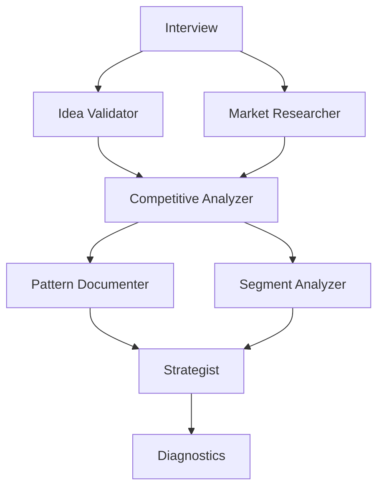

# product-ideation

Evaluates a product idea through a six-agent research pipeline and delivers a BUY/HOLD/SELL recommendation.

## Invocation and usage

```
/the-bulwark:product-ideation <idea-description>
/the-bulwark:product-ideation --doc <path-to-idea-file>
```

**Arguments:**

| Argument | Description |
|----------|-------------|
| `<idea-description>` | Free-text description of the product idea, inline |
| `--doc <path>` | Path to a file containing the idea description |

**Examples:**

```
/the-bulwark:product-ideation a mobile app that lets freelancers track client payments with automated invoice reminders
```

```
/the-bulwark:product-ideation an API-first platform for managing multi-tenant SaaS billing with usage-based pricing
```

```
/the-bulwark:product-ideation --doc plans/ideas/saas-invoicing-tool.md
```

```
/the-bulwark:product-ideation --doc notes/product-concept-marketplace.md
```

After invocation, the skill conducts a short interview (1-2 rounds of questions) to clarify the idea, then runs six agents across four pipeline stages. The final output includes: per-agent stage reports in `logs/`, a final BUY/HOLD/SELL strategy report, and a diagnostic YAML file summarizing pipeline execution.

## Who is it for

- Product managers evaluating whether an idea is worth committing engineering time to
- Founders doing pre-build research before writing a single line of code
- Teams that want structured, evidence-backed assessments instead of gut-feel decisions
- Anyone comparing multiple product ideas who needs a consistent evaluation framework

## Who is it not for

- Evaluating an existing live product or company. Use a financial analysis tool instead.
- Making technical architecture decisions for a product you've already committed to building. The idea stage has passed.
- Running competitive analysis in isolation without a product idea as the anchor. Use `/the-bulwark:bulwark-research` for general research.

## Why

Asking Claude "is this a good product idea?" gives you a single-pass opinion. It draws on training data, applies some general reasoning, and gives you an answer. That answer might be correct. It might also miss market dynamics, competitive gaps, or segment economics that only surface with dedicated research.

The product-ideation skill replaces that single pass with six focused agents, each responsible for one dimension of the evaluation. A market researcher quantifies the opportunity. A competitive analyzer maps the landscape. A segment analyzer builds personas and willingness-to-pay estimates. A pattern documenter extracts success and failure patterns from competitors. Each agent grounds its claims in web research, not just parametric knowledge.

The strategist reads all five prior reports and produces a recommendation using defined thresholds. The result is a structured assessment you can act on, not a paragraph of hedged optimism.

## How it works

The pipeline runs across five stages. Stages 1 and 3 run agents in parallel. Stages 2 and 4 run sequentially because they depend on prior output.



**Stage 0: Interview.** The orchestrator parses your input and asks up to 4 clarifying questions: target problem, business model, geographies, and known competitors. A second round of follow-ups runs if answers are incomplete. The result is a synthesized idea brief that all downstream agents receive.

**Stage 1: Idea Validator + Market Researcher (parallel).** Two agents launch simultaneously. The [idea validator](../agents/product-ideation-idea-validator.md) assesses feasibility, timing, uniqueness, and problem-solution fit, producing a PASS/CONDITIONAL/FAIL verdict. The [market researcher](../agents/product-ideation-market-researcher.md) quantifies the opportunity using TAM/SAM/SOM, PESTLE, and web research (minimum 5 sources). Both agents write structured reports to `logs/`.

**Stage 2: Competitive Analyzer (sequential).** The [competitive analyzer](../agents/product-ideation-competitive-analyzer.md) reads the market research output and performs competitive intelligence. It profiles at least 3 direct competitors and 2 failed competitors, applies Porter's Five Forces, and identifies market gaps. Runs after Stage 1 because it builds on market research findings.

**Stage 3: Pattern Documenter + Segment Analyzer (parallel).** Two agents launch simultaneously, both reading the competitive analysis output. The [pattern documenter](../agents/product-ideation-pattern-documenter.md) extracts success patterns, failure patterns, and opportunity gaps from the competitive landscape. The [segment analyzer](../agents/product-ideation-segment-analyzer.md) identifies target user segments, builds personas using Jobs-to-be-Done, and estimates willingness to pay.

**Stage 4: Strategist (sequential).** The [strategist](../agents/product-ideation-strategist.md) reads all five prior reports and produces the final BUY/HOLD/SELL recommendation with a confidence level (High/Medium/Low). The recommendation follows defined thresholds. The full strategy report is presented to you directly.

**Stage 5: Diagnostics.** A YAML file is written recording pipeline metadata: which stages succeeded or failed, all log file paths, interview rounds conducted, and the final recommendation.

If you provide input that the idea validator flags as FAIL, the skill pauses and asks whether to continue or refine the idea before proceeding.

## Output

All output is written to `logs/` in the project directory. Each file is timestamped.

| File | Contents |
|------|----------|
| `product-ideation-idea-validation-{timestamp}.md` | Feasibility verdict (PASS/CONDITIONAL/FAIL), strengths, concerns |
| `product-ideation-market-research-{timestamp}.md` | Market size estimates, growth trends, key players, regulatory context |
| `product-ideation-competitive-analysis-{timestamp}.md` | Competitor profiles, pricing analysis, market gaps |
| `product-ideation-patterns-{timestamp}.md` | Success patterns, failure patterns, opportunity gaps |
| `product-ideation-segments-{timestamp}.md` | User segments, personas, willingness-to-pay estimates |
| `product-ideation-strategy-{timestamp}.md` | Final BUY/HOLD/SELL recommendation with rationale and next steps |
| `diagnostics/product-ideation-{timestamp}.yaml` | Pipeline execution metadata |

The strategy report is the primary deliverable. The five intermediate reports provide the evidence chain behind the recommendation.
