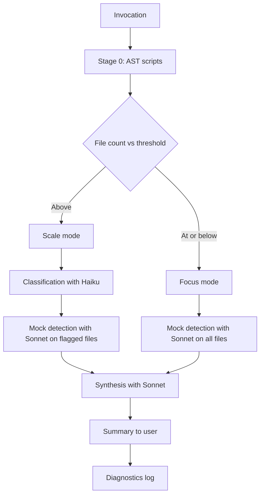

# test-audit

Audits test suites for mock abuse, skipped tests, and broken verification chains using AST analysis and multi-agent LLM judgment.

## Invocation and usage

```
/the-bulwark:test-audit [path] [--threshold=N]
```

**Arguments:**

| Argument | Description |
|----------|-------------|
| `[path]` | File or directory to audit. A single test file gets direct analysis. A directory scans all `*.test.*` and `*.spec.*` files within it. Defaults to files in recent context if omitted. |

**Flags:**

| Flag | Description |
|------|-------------|
| `--threshold=N` | File count cutoff between Focus mode and Scale mode. Default is 5. Set higher to force Focus mode on larger directories, or lower to trigger Scale mode earlier. |

**Examples:**

```
/the-bulwark:test-audit src/__tests__/auth.test.ts
```
Audit a single test file. Runs in Focus mode (skips classification, goes straight to mock detection).

```
/the-bulwark:test-audit tests/
```
Audit all test files in the `tests/` directory. Mode is selected automatically based on file count vs threshold.

```
/the-bulwark:test-audit src/ --threshold=10
```
Audit all tests under `src/` with a raised threshold. Files numbering 10 or fewer use Focus mode. Above 10 triggers Scale mode.

```
/the-bulwark:test-audit tests/integration/ --threshold=2
```
Force Scale mode on a small directory by lowering the threshold.

**Two modes:**

- **Focus mode** (file count at or below threshold). Skips classification entirely. Every file goes straight to mock detection with full AST metadata. Deeper per-file analysis, better for small targets.
- **Scale mode** (file count above threshold). Classifies files first using fast Haiku agents to identify which ones need deeper inspection. Only flagged files proceed to mock detection. More efficient for large test suites.

**Outputs:** Classification report (Scale mode only), mock detection findings per file, a synthesis report with T1-T4 violation counts and effectiveness scores, and a diagnostic log recording mode selection and AST script status.

## Who is it for

- Developers who want to verify that their test suite actually tests behavior, not just function calls
- Teams inheriting a codebase with unknown test quality
- Pipeline stages that need a quality gate before merging
- Anyone who has seen tests pass with 100% coverage while real bugs ship to production

## Who is it not for

- Running tests. Use `just test`.
- General code review. Use `/the-bulwark:code-review`.
- Debugging test failures. Use `/the-bulwark:issue-debugging`.
- Writing new tests from scratch. Implement directly or use `/the-bulwark:bulwark-verify` for verification script generation.

## Why

AI-generated test suites pass. They compile, they run green, and they report high coverage numbers. But passing is not the same as verifying. A test that mocks the system under test and asserts the mock was called proves nothing about the real code. A test that constructs fake data instead of calling real functions skips the entire execution path it claims to cover. These tests create false confidence: the suite looks healthy, but bugs ship because no test exercises the actual behavior.

The Bulwark defines four testing rules that address this directly. T1: never mock the system under test. T2: verify observable output, not function calls. T3: integration tests use real systems. T4: run tests before declaring them complete. Violations of these rules are the most common failure mode in AI-assisted development, and they're invisible to coverage tools.

This skill enforces T1-T4 systematically. Stage 0 runs three AST scripts that extract deterministic metadata: exact line counts, skip markers, and data flow analysis for broken verification chains. The LLM stages then apply nuanced judgment on top of that foundation. Classification (Scale mode) decides which files warrant deep inspection. Mock detection evaluates whether each mock is legitimate or a violation. Synthesis aggregates findings into a prioritized report with rewrite triggers. The combination of deterministic AST analysis and LLM judgment catches violations that neither approach would find alone.

## How it works



**Stage 0: AST scripts.** Three TypeScript scripts run before any LLM stage. `verify-count` computes exact assertion and verification line counts per file. `skip-detect` finds `.skip`, `.only`, and `.todo` markers (T4 violations). `ast-analyze` traces data flow to identify broken verification chains where manually constructed data replaces real function output (T3+ violations). These scripts use ts-morph for AST parsing and produce deterministic JSON output. If any script fails, the pipeline continues with LLM-only analysis for that dimension.

**Mode selection.** File count is compared against the threshold (default 5, overridable via `--threshold`). At or below the threshold selects Focus mode. Above it selects Scale mode. A safety cap forces Scale mode for any target with more than 25 files regardless of threshold.

**Classification (Scale mode only).** Haiku sub-agents classify each test file by type (unit, integration, E2E) and flag files that need deeper mock analysis. AST metadata from Stage 0 is injected as context to improve classification accuracy. Files above 20 are batched in groups of 20-25 and classified in parallel.

**Mock detection.** Sonnet sub-agents analyze each file for T1-T4 violations. In Focus mode, all files are analyzed and the agent self-computes classification metadata from AST output. In Scale mode, only files flagged by classification are analyzed, and classification metadata is passed forward. Files above 10 are batched in groups of 10-15.

**Synthesis.** A Sonnet sub-agent aggregates detection findings into a prioritized report. Violations are classified as P0 (false confidence, T1/T3+), P1 (incomplete verification, T2/T3), or P2 (pattern issues, T4/style). Two quality gates evaluate the results. Gate 1 triggers rewrites on any P0 violation. Gate 2 triggers rewrites when P1 violations exist alongside effectiveness scores below 95%. P2-only results are advisory.

**Rewrites.** When a quality gate fires, the skill automatically rewrites failing tests using assertion-patterns and component-patterns references, with edge case data from bug-magnet-data.

## Output

| File | Description |
|------|-------------|
| Console output | Audit summary with file counts, violation counts by priority, overall effectiveness score, and rewrite status |
| `logs/test-classification-{timestamp}.yaml` | Classification results per file (Scale mode only) |
| `logs/mock-detection-{timestamp}.yaml` | Per-file mock detection findings with violation types and severity |
| `logs/test-audit-{timestamp}.yaml` | Synthesis report with prioritized violations, effectiveness scores, and rewrite directive |
| `logs/diagnostics/test-audit-{timestamp}.yaml` | Diagnostic log recording mode selection, threshold, AST script status, and gate evaluation |
